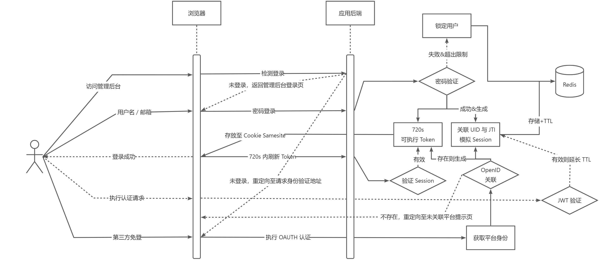

# 简介

DSL 遵循 RESTFul 标准进行设计，使用标准的 HTTP 响应代码 ，所有请求和响应均为 application/json。

## 基础路径

```
http(s)://<domain>/:collection
```

## 调用说明

所有的请求方式（Method）均与动词相关：

- GET：获取资源
- POST：创建与自定义更新资源
- PUT：替换更新资源
- PATCH：局部更新资源
- DELETE：删除资源

## 认证



## 错误

```

```

## 状态码说明

```

```

## 业务码说明

```

```

## 字段类型

```

```
