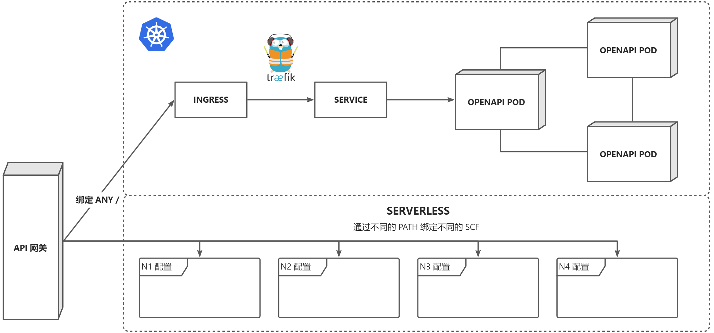

# 开放服务


开放服务接口，混合 Serverless 架构负责处理通用信息查询、数据加工、文件处理、工作流等。

> 请使用 `v*.*.*` 发布的版本（预发布是构建测试）

## 部署服务

建议同时采用两种架构部署，优先部署常驻服务，推荐采用 Kubernetes 进行编排，再将无需预热且弹性的部分部署至 Serverless，最终通过 API 网关进行分割。



镜像源包括：

- ghcr.io/weplanx/openapi:latest
- ccr.ccs.tencentyun.com/weplanx/openapi:latest（国内）

### 常驻服务

案例将使用 Kubernetes 部署编排，复制部署内容（需要根据情况做修改）：

```yaml
apiVersion: apps/v1
kind: Deployment
metadata:
  name: openapi
spec:
  replicas: 3
  selector:
    matchLabels:
      app: openapi
  template:
    metadata:
      labels:
        app: openapi
    spec:
      containers:
        - image: ccr.ccs.tencentyun.com/weplanx/openapi:<version>
          imagePullPolicy: Always
          name: openapi
          env:
            - name: "DATABASE_DBNAME"
              value: <Database>
            - name: "DATABASE_URI"
              value: <MongoDB URI>
          ports:
            - containerPort: 9000
---
apiVersion: v1
kind: Service
metadata:
  name: openapi
spec:
  ports:
    - port: 9000
      protocol: TCP
  selector:
    app: openapi
---
apiVersion: traefik.containo.us/v1alpha1
kind: Middleware
metadata:
  name: openapi-stripprefix
spec:
  stripPrefix:
    prefixes:
      - /<hash url>
---
apiVersion: traefik.containo.us/v1alpha1
kind: Middleware
metadata:
  name: openapi-auth
spec:
  basicAuth:
    secret: openapi
---
apiVersion: v1
kind: Secret
metadata:
  name: openapi
data:
  users: |2
    ...
---
apiVersion: networking.k8s.io/v1
kind: Ingress
metadata:
  name: openapi
  annotations:
    traefik.ingress.kubernetes.io/router.entrypoints: websecure
    traefik.ingress.kubernetes.io/router.middlewares: default-openapi-stripprefix@kubernetescrd,default-openapi-auth@kubernetescrd
spec:
  rules:
    - host: openapi.developer.com
      http:
        paths:
          - path: /<hash url>
            pathType: Prefix
            backend:
              service:
                name: openapi
                port:
                  number: 9000
```

### SERVERLESS

这部分部署在腾讯云，创建云函数并选择“使用容器镜像”，函数类型选择“Web 函数”，镜像需要是腾讯云镜像仓库地址（即 ccr.ccs.tencentyun.com/weplanx/openapi ），最后点击完成


