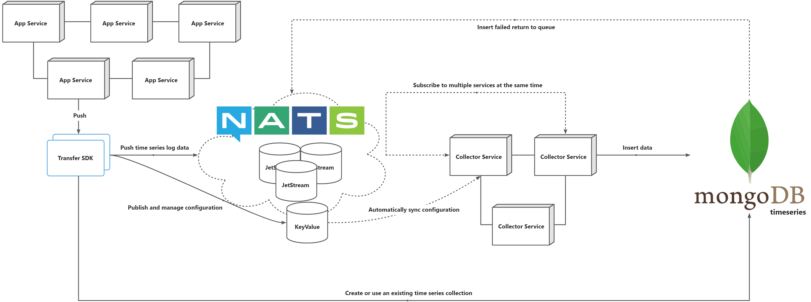

# 日志传输

[](https://github.com/weplanx/transfer/actions)
[](https://coveralls.io/github/weplanx/transfer)
[](https://github.com/weplanx/transfer)
[](https://goreportcard.com/report/github.com/weplanx/transfer)
[](https://github.com/weplanx/transfer)
[](https://raw.githubusercontent.com/weplanx/transfer/main/LICENSE)

日志传输客户端是以 Push 为主的模式，作用是对日志流队列进行统一管理，将高频写入的日志数据进行削峰缓冲，同时填补非高可用日志系统的可靠性，配合相同命名空间的日志采集服务写入日志系统



请使用 `v*.*.*` 发布的版本（预发布是构建测试）



## 客户端

```shell
go get github.com/weplanx/transfer
```

服务中的角色



### New(namespace string, js nats.JetStreamContext)

创建传输客户端

- **namespace **命名空间，同时也等于 InfluxDB 2.0 中的 Bucket 命名
- **js** Nats JetStream 上下文

```go
package main

import (
	"github.com/nats-io/nats.go"
	"github.com/weplanx/transfer"
	"log"
	"time"
)

func main() {
	var err error
	var nc *nats.Conn
	var js nats.JetStreamContext
	if nc, err = nats.Connect(
		"nats://127.0.0.1:4222,nats://127.0.0.1:4223,nats://127.0.0.1:4224",
		nats.MaxReconnects(5),
		nats.ReconnectWait(2*time.Second),
		nats.ReconnectJitter(500*time.Millisecond, 2*time.Second),
		nats.Token("s3cr3t"),
	); err != nil {
		return
	}
	if js, err = nc.JetStream(nats.PublishAsyncMaxPending(256)); err != nil {
		panic(err)
	}
	var client *transfer.Transfer
	if client, err = transfer.New("example", js); err != nil {
		log.Fatalln(err)
	}
	client.Get("e2066c57-5669-d2d8-243e-ba19a6c18c45")
}
```

### .Get(measurement string)

获取日志流传输信息，JetStream 状态

- **measurement** 度量

```go
func TestTransfer_Get(t *testing.T) {
	_, err := client.Get("not_exists")
	assert.Error(t, err)
	result, err := client.Get("system")
	assert.Nil(t, err)
	t.Log(result)
}
```

### Option

- **Measurement** 度量
- **Description** 描述

### .Set(option Option)

设置日志流传输

- **option **配置

```go
func TestTransfer_Set(t *testing.T) {
	err := client.Set(transfer.Option{
		Measurement: "system",
		Description: "测试",
	})
	assert.Nil(t, err)
}
```

### .Remove(measurement string)

移除日志流传输

- **measurement** 度量

```go
func TestTransfer_Remove(t *testing.T) {
	err := client.Remove("system")
	assert.Nil(t, err)
}

```

### Payload

配合 **Collector** 接收数据的类型，采用 JSON 传输

```go
type Payload struct {
	// 标签
	Tags map[string]string `json:"tags"`

	// 字段
	Fields map[string]interface{} `json:"fields"`

	// 时间
	Time time.Time `json:"time"`
}
```

### .Publish(ctx context.Context, measurement string, payload Payload)

发布日志

- **measurement** 度量
- **payload** 载荷

```go
func TestTransfer_Publish(t *testing.T) {
	var wg sync.WaitGroup
	wg.Add(1)
	subject := fmt.Sprintf(`%s.logs.%s`, "test", "system")
	queue := fmt.Sprintf(`%s:logs:%s`, "test", "system")
	now := time.Now()
	go js.QueueSubscribe(subject, queue, func(msg *nats.Msg) {
		var payload transfer.Payload
		if err := sonic.Unmarshal(msg.Data, &payload); err != nil {
			t.Error(err)
		}
		t.Log(payload)
		assert.Equal(t, "0ff5483a-7ddc-44e0-b723-c3417988663f", payload.Tags["uuid"])
		assert.Equal(t, map[string]interface{}{"msg": "hi"}, payload.Fields["data"])
		assert.Equal(t, now.UnixNano(), payload.Time.UnixNano())
		wg.Done()
	})
	err := client.Publish(context.TODO(), "system", transfer.Payload{
		Tags: map[string]string{
			"uuid": "0ff5483a-7ddc-44e0-b723-c3417988663f",
		},
		Fields: map[string]interface{}{
			"data": map[string]interface{}{
				"msg": "hi",
			},
		},
		Time: now,
	})
	assert.Nil(t, err)
	wg.Wait()
}
```

## License

[BSD-3-Clause License](https://github.com/weplanx/transfer/blob/main/LICENSE)
