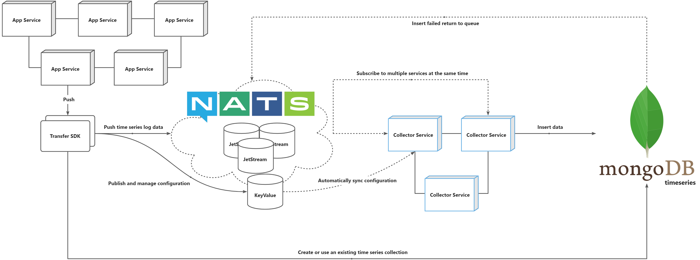

# 日志采集


日志采集服务在 NATS JetStream 基础上订阅匹配与 [Transfer](https://github.com/weplanx/transfer) 传输客户端相同的命名空间，自动进行配置调度、 日志系统写入



请使用 `v*.*.*` 发布的版本（预发布是构建测试）



## 部署服务

通过 Transfer 分发的配置 Collector 将对应监听并同步订阅，支持多个 Collector 同时针对同个命名空间进行订阅收集，命名空间（即 namespace）等价于 InfluxDB 的 Bucket，日志系统架构如图：



镜像源主要有：

- ghcr.io/weplanx/collector:latest
- ccr.ccs.tencentyun.com/weplanx/collector:latest（国内）

案例将使用 Kubernetes 部署编排，复制部署内容（需要根据情况做修改）：

### 配置

- **namespace** 应用命名空间
- **nats** Nats 消息中间件，需要支持 JetStream
- **influx **InfluxDB 时序数据库

```yaml
apiVersion: v1
kind: ConfigMap
metadata:
  name: collector
data:
  config.yml: |
    namespace: <namespace>
    nats:
      hosts:
        - nats://<k8s_service>.default.svc.cluster.local:4222
      nkey: <Your NKey>
    influx:
      url: <influxdb 2.0 url>
      token: 
      org:
```

```yaml
apiVersion: apps/v1
kind: Deployment
metadata:
  name: collector
spec:
  replicas: 3
  selector:
    matchLabels:
      app: collector
  template:
    metadata:
      labels:
        app: collector
    spec:
      containers:
        - image: ccr.ccs.tencentyun.com/weplanx/collector:<version>
          imagePullPolicy: Always
          name: collector
          volumeMounts:
            - name: config
              mountPath: "/app/config"
              readOnly: true
      volumes:
        - name: config
          configMap:
            name: collector
            items:
              - key: "config.yml"
                path: "config.yml"
```

## 滚动更新

复制模板内容，并需要自行定制触发条件，原理是每次 patch 将模板中 `${tag}`替换为版本执行

```yaml
spec:
  template:
    spec:
      containers:
        - image: ccr.ccs.tencentyun.com/weplanx/collector:${tag}
          name: collector
```

例如：在 Github Actions 中，国内可使用 **Coding 持续部署** 或 **云效流水线** 等

```shell
patch deployment collector --patch "$(sed "s/\${tag}/${{steps.meta.outputs.version}}/" < ./config/patch.yml)"
```

## License

[BSD-3-Clause License](https://github.com/weplanx/collector/blob/main/LICENSE)
