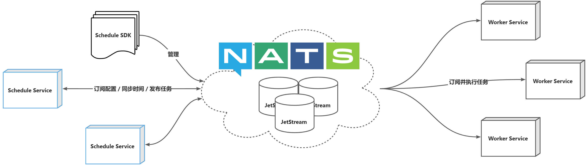

# 调度发布


分布定时调度服务，定时向队列发布待触发的工作任务，配合相同命名空间的 [Worker](https://github.com/weplanx/worker) 节点执行任务

> 以 `v*.*.*` 形式发布（预发布用于构建测试）

## 客户端

已无需部署基于 gRPC 与 MonogDB 的传输微服务，现有方式直接通过 NATS JetStream 封装客户端进行传输与配置，但版本需要 `>=v1.2.0`。

```shell
go get github.com/weplanx/schedule
```

### 初始化

**New(namespace string, nc *nats.Conn, js nats.JetStreamContext) (*Schedule**error)\*\*

- _namespace 命名空间_
- _nc NATS 客户端_
- _js NATS JetStream 上下文_

```go
nc, _ := nats.Connect(nats.DefaultURL)
js, _ := nc.JetStream(nats.PublishAsyncMaxPending(256))
schedule, _ := client.New("beta", nc, js)
```

### 列出配置标识

**List() (keys []string, err error)**

- _keys 唯一标识数组_

```go
keys, _ := schedule.List()
```

### 获取调度信息

**Get(key string) (jobs []common.Job, err error)**

- _key 唯一标识_
- _jobs 返回配置与状态_
  - _mode 触发方式_
  - _spec 计时规格_
  - _option 配置_
  - _state 状态_
    - _next 下次触发时间_
    - _prev 上次触发时间_

```go
result, _ := schedule.Get("test")
```

### 设置调度

**Set(key string, jobs ...common.Job) (err error)**

- _key 唯一标识_
- _jobs 设置配置_
  - _mode 触发方式_
  - _spec 计时规格_
  - _option 配置_

**HttpJob(spec string, option HttpOption) Job**

- _spec 计时规格_
- _option 配置_
  - _url 网络回调地址_
  - _headers 请求头部_
  - _body 请求体_

```go
job := common.HttpJob("@every 15s", common.HttpOption{
    Url:     "https://api.developer.com",
    Headers: map[string]string{},
    Body:    map[string]interface{}{},
})
schedule.Set("test", job)
```

### 移除调度

**Remove(key string) (err error)**

- _key 唯一标识_

```go
schedule.Remove("test")
```

## 部署发布节点

调度发布服务在 NATS JetStream 基础上订阅匹配相同命名空间的工作配置，建议部署 >= 2 个调度服务节点确保定时任务发布的可用性，增加新节点或设置一个工作任务时将在间隔 < 3s 内同步集群所有节点对应工作任务的时间起点



支持镜像源主要有：

- Github`ghcr.io/weplanx/schedule:latest`
- 腾讯云`ccr.ccs.tencentyun.com/weplanx/schedule:latest`

案例将使用 Kubernetes 部署编排，复制部署内容（需要根据情况做修改）：

### 配置

```yaml
apiVersion: v1
kind: ConfigMap
metadata:
  name: schedule.cfg
data:
  config.yml: |
    namespace: <namespace>
    debug: false
    nats:
      hosts:
        - "nats://a.nats:4222"
        - "nats://b.nats:4222"
        - "nats://c.nats:4222"
      nkey: "<nkey>"
```

### 部署

```yaml
apiVersion: apps/v1
kind: Deployment
metadata:
  labels:
    app: schedule
  name: schedule
spec:
  selector:
    matchLabels:
      app: schedule
  template:
    metadata:
      labels:
        app: schedule
    spec:
      containers:
        - image: ccr.ccs.tencentyun.com/weplanx/schedule:latest
          imagePullPolicy: Always
          name: schedule
          volumeMounts:
            - name: config
              mountPath: "/app/config"
              readOnly: true
      volumes:
        - name: config
          configMap:
            name: schedule.cfg
            items:
              - key: "config.yml"
                path: "config.yml"
```

## 滚动更新

复制模板内容，并需要自行定制触发条件，原理是每次 patch 将模板中 `${tag}`替换为版本执行

```yaml
spec:
  template:
    spec:
      containers:
        - image: ccr.ccs.tencentyun.com/weplanx/schedule:${tag}
          name: schedule
```

例如：在 Github Actions 中，国内可使用 **Coding 持续部署** 或 **云效流水线** 等

```shell
patch deployment schedule --patch "$(sed "s/\${tag}/${{steps.meta.outputs.version}}/" < ./config/patch.yml)"
```

## License

[BSD-3-Clause License](https://github.com/weplanx/schedule/blob/main/LICENSE)
