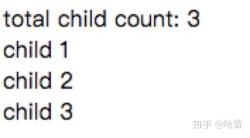

`ng-content` 可以创建类似于 `div` `span` 等内部可以插入元素的组件，比如下面的 `app-ng-content-simple` 他的作用和 `span` 一样

```typescript
@Component({
  selector: "app-ng-content-simple",
  template: "<ng-content></ng-content>",
  styleUrls: ["./ng-content-simple.component.sass"],
})
export class NgContentSimpleComponent implements OnInit {
  constructor() {}

  ngOnInit() {}
}
```

用法

```ng2
<app-ng-content-simple> I am a simple ng content </app-ng-content-simple>
```

`ng-content` 指令有一个 `[select]` 输入，使用方式如同 css selector, 可以对包含的内容进行过滤展示。以下例子展示了标签，属性，css 类选择性地展示内容。

```typescript
@Component({
  selector: "app-ng-content-select",
  template: `
    <ng-content></ng-content>
    <ng-content select="span"></ng-content>
    <ng-content select="[attribute]"></ng-content>
    <ng-content select=".class"></ng-content>
  `,
  styleUrls: ["./ng-content-select.component.sass"],
})
export class NgContentSelectComponent implements OnInit {
  constructor() {}

  ngOnInit() {}
}
```

用法

```ng2
<app-ng-content-select>
  <div>simple content</div>
  <span style="display:block">span content</span>
  <div attribute>content with attribute</div>
  <div class="class">content with css class</div>
</app-ng-content-select>
```

某些特定的实现 `<parent><child></child></parent>` 作为一个整体组件使用，child 可以是定制化的不同组件。parent 拥有不同的状态比如 `parent.active` 表示该组件是否是选中状态，此时 child 组件要如何获取这个状态，这就涉及到组件间通信，有非常多的处理方式。

Angular 提供了 `[ngTemplateOutlet]` 指令，用于渲染 `TemplateRef` 模板实例，结合 `ngTemplateOutletContext` 提供 context，`TemplateRef` 可以获取 context 进行操作渲染。

以下例子定义了一个具有 `timer` 状态的 parent 组件，并能想嵌入内部在 child 模板内容提供 `context={timer}` 的上下文用于子内容的渲染。注意到模板组件的定义 `TemplateRef<{$implicit: number; timer: number}>` 泛型的类型申明为 `{$implicit: number; timer: number}` 为提供的 context 的类型，`$implicit` 为 context 默认提供的对象，这里的 `let-timer="timer"` 也可以写成 `let-timer`，效果一致。

`<ng-container *ngTemplateOutlet="template; context: context"></ng-container>`。这里 `[ngTemplateOutlet]` 用作结构指令，绑定结构指令的属性 `ngTemplateOutletContext` 写在 `ngTemplateOutlet` 表达式内部 `context: context`（Angular 黑科技，传承了 AngularJS）。其他博客有 `<ng-template [ngTemplateOutlet]="template"></ng-template>` 的用法，但貌似官方文档并没有提倡这么用 Angular Docs。而且逻辑上这边是往 DOM 里插入节点，更接近结构指令的用法。

```typescript
@Component({
  selector: "app-ng-content-context",
  template:
    '<ng-container *ngTemplateOutlet="template; context: context"></ng-container>',
  styleUrls: ["./ng-content-context.component.sass"],
})
export class NgContentContextComponent implements OnInit, OnDestroy {
  @ContentChild(TemplateRef, { read: TemplateRef }) template: TemplateRef<{
    $implicit: number;
    timer: number;
  }>;

  timer = 0;

  intervalSub: Subscription;

  get context() {
    const { timer } = this;
    return {
      $implicit: timer,
      timer,
    };
  }

  constructor() {}

  ngOnInit() {
    this.intervalSub = interval(1000).subscribe(() => {
      this.timer++;
    });
  }

  ngOnDestroy() {
    this.intervalSub.unsubscribe();
  }
}
```

用法

```html
<app-ng-content-context>
  <ng-template let-timer="timer">{{timer}}</ng-template>
</app-ng-content-context>
```

接上个例子，除了用 `[ngTemplateOutlet]` 来提供 context，可以通过注入来获得 parent 的成员。在复杂组件的开发中，也是常用的方法。

如下面这个例子 parent 组件用作统计 child 组件的数量，给定 child 组件 id 的功能，作为一个 master 节点与 child 交流。而 child 通过在 `constructor` 注入 parent 实例，注册自己、获取 id。

Angular 在应用运行时在内存中会有一个依赖注入的树，每个组件实例化之后也会在这个依赖注入树上注册一个相应的节点，可注入下游组件。每个组件实例去请求某个依赖的时候，都会在树的某一个对应的位置向上寻找。这边 child 组件通过 Host 装饰器，会只在局部寻找 parent 组件（官方局部解释：host element of the current component. 可理解为寻找到 usage 所在的组件为止）。



子组件

```typescript
@Component({
  selector: "app-ng-content-inject-child",
  template: "<div>child {{id}}</div>",
  styleUrls: ["./ng-content-inject-child.component.sass"],
})
export class NgContentInjectChildComponent implements OnInit {
  id: number;

  constructor(@Host() private parent: NgContentInjectComponent) {}

  ngOnInit() {
    this.parent.register();
    this.id = this.parent.childCount;
  }
}
```

宿主组件

```typescript
@Component({
  selector: "app-ng-content-inject",
  template: `
    <div>total child count: {{ childCount }}</div>
    <ng-content></ng-content>
  `,
  styleUrls: ["./ng-content-inject.component.sass"],
})
export class NgContentInjectComponent implements OnInit {
  name = "parent";

  childCount = 0;

  constructor() {}

  ngOnInit() {}

  register() {
    this.childCount++;
  }
}
```

用法

```ng2
<app-ng-content-inject>
  <app-ng-content-inject-child></app-ng-content-inject-child>
  <app-ng-content-inject-child></app-ng-content-inject-child>
  <app-ng-content-inject-child></app-ng-content-inject-child>
</app-ng-content-inject>
```

> 作者：哈雷 <br>
> 原文：<https://zhuanlan.zhihu.com/p/39486706>
