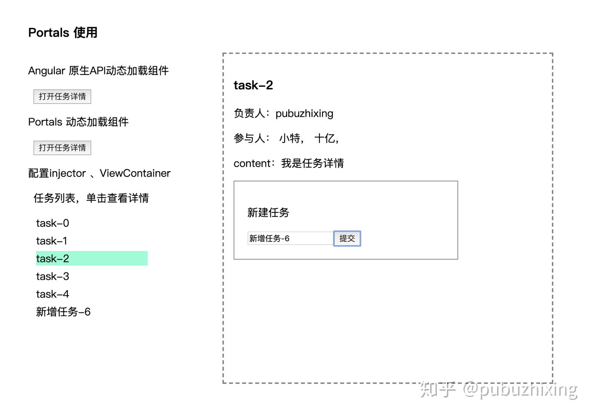
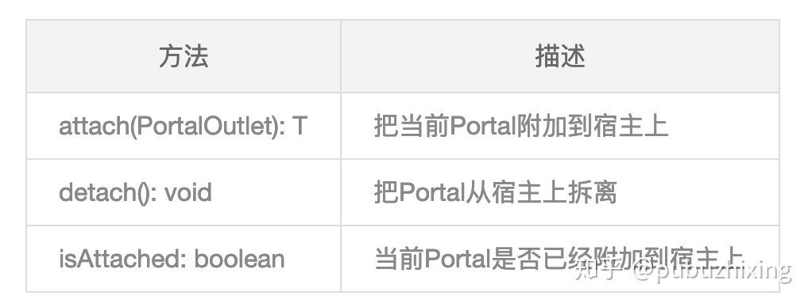
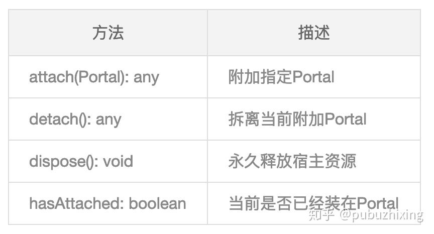
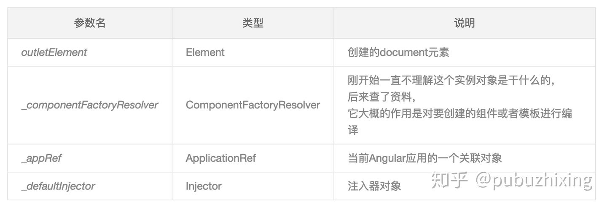

这篇文章主要介绍使用 Angular api 和 CDK Portals 两种方式实现动态创建组件，另外还会讲一些跟它相关的知识点，如：Angular 多级依赖注入、ViewContainerRef，Portals 可以翻译为 门户 ，我觉得放到这里叫 入口 更好，可以理解为动态创建组件的入口，类似于小程序或者 Vue 中的 Slot.

## 动态创建组件

想想应用的路由，一般配置路由地址的时候都会给这个地址配置一个入口组件，当匹配到这个路由地址的时候就在指定的地方渲染这个组件，动态创建组件类似，在最页面未接收到用户行为的时候，我不知道页面中这块区域应该渲染那个组件，当页面加载时根据数据库设置或者用户的操作行为才能确定最终要渲染的组件，这时候就要用代码动态创建组件把目标组件渲染到正确的地方。



## 使用 Angular API 动态创建组件

该路由的入口组件是 PortalsEntryConponent 组件，如上面截图所示右侧有一块虚线边框的区域，里面具体的渲染组件不确定。

### 第一步

先在视图模板中定义一个占位的区域，动态组件就要渲染在这个位置，起一个名称 `#virtualContainer` 文件 portals-entry.component.html

```html
<div class="portals-outlet">
  <ng-container #virtualContainer> </ng-container>
</div>
```

### 第二步

通过 ViewChild 取到这个 container 对应的逻辑容器 文件 portals-entry.component.ts

```typescript
@ViewChild('virtualContainer', { read: ViewContainerRef })
virtualContainer: ViewContainerRef;
```

### 第三步

处理单击事件，单击按钮时动态创建一个组件，portals-entry.component.ts 完整逻辑

```typescript
import { TaskDetailComponent } from "../task/task-detail/task-detail.component";
@Component({
  selector: "app-portals-entry",
  templateUrl: "./portals-entry.component.html",
  styleUrls: ["./portals-entry.component.scss"],
  providers: [],
})
export class PortalsEntryComponent implements OnInit {
  @ViewChild("virtualContainer", { read: ViewContainerRef })
  virtualContainer: ViewContainerRef;
  constructor(
    private dynamicComponentService: DynamicComponentService,
    private componentFactoryResolver: ComponentFactoryResolver,
    private injector: Injector
  ) {}
  ngOnInit() {}
  openTask() {
    const task = new TaskEntity();
    task.id = "1000";
    task.name = "写一篇关于Portals的文章";
    const componentFactory =
      this.componentFactoryResolver.resolveComponentFactory(
        TaskDetailComponent
      );
    const componentRef =
      this.virtualContainer.createComponent<TaskDetailComponent>(
        componentFactory,
        null,
        this.virtualContainer.injector
      );
    (componentRef.instance as TaskDetailComponent).task = task; // 传递参数
  }
}
```

### 代码说明

- openTask()方法绑定到模板中按钮的单击事件
- 导入要动态创建的组件 TaskDetailComponent
- constructor 注入 injector、componentFactoryResolver 动态创建组件需要的对象，只有在组件上下文中才可以拿到这些实例对象
- 使用 api 创建组件，现根据组件类型创建一个 ComponentFactory 对象，然后调用 viewContainer 的 createComponent 创建组件
- 使用 componentRef.instance 获取创建的组件实例，这里用来设置组件的 task 属性值

### 其它

ViewContainerRef 除了 createComponent 方法外还有一个 createEmbeddedView 方法，用于创建模板

```typescript
@ViewChild('customTemplate')
customTemplate: TemplateRef<any>;
this.virtualContainer.createEmbeddedView(this.customTemplate, { name: 'pubuzhixing' });
```

createEmbeddedView 方法的第二个参数，用于指定模板的上下文参数，看下模板定义及如何使用参数

```ng2
<ng-template #customTemplate let-name="name">
  <p>自定义模板，传入参数name：{{name}}</p>
</ng-template>
```

此外还可以通过 ngTemplateOutlet 直接插入内嵌视图模板，通过 ngTemplateOutletContext 指定模板的上下文参数

```ng2
<ng-container
  [ngTemplateOutlet]="customTemplate"
  [ngTemplateOutletContext]="{ name:'pubuzhixing' }"
></ng-container>
```

### 小结

分析下 Angular 动态创建组件/内嵌视图的 API，动态创建组件首先需要一个被创建的组件定义或模板声明，另外需要 Angular 上下文的环境来提供这个组件渲染在那里以及这个组件的依赖从那获取，viewContainerRef 是动态组件的插入位置并且提供组件的逻辑范围，此外还需要单独传入依赖注入器 injector，示例直接使用逻辑容器的 injector，是不是很好理解。

## CDK Portal 文档介绍

这里先对 Portal 相关的内容做一个简单的说明，后面会有两个使用示例，本来这块内容准备放到最后的，最终还是决定放在前面，可以先对 Portals 有一个简单的了解，如果其中有翻译不准确请见谅，官方文档地址：<https://material.angular.io/cdk>

portals 提供渲染动态内容到应用的可伸缩的实现，其实就是封装了 Angular 动态创建组件的过程

### Portals

这个 Portal 指是能动态渲染一个指定位置的 UI 块 到页面中的一个 open slot 。 UI 块 指需要被动态渲染的内容，可以是一个组件或者是一个模板，而 open slot 是一个叫做 PortalOutlet 的开放的占位区域。 Portals 和 PortalOutlets 是其它概念中的低级的构造块，像 overlays 就是在它基础上构建的

```typescript
Portal<T> 包括动态组件的抽象类，可以是TemplatePortal（模板）或者ComponentPortal（组件）
```



```html
PortalOutlet 动态组件的宿主
```



### 代码片段说明

CdkPortal

```ng2
<ng-template cdkPortal>
  <p>The content of this template is captured by the portal.</p>
</ng-template>
<!-- OR -->
<!-- 通过下面的结构指令语法可以得到同样的结果 -->
<p *cdkPortal>The content of this template is captured by the portal.</p>
```

可以通过 ViewChild、ViewChildren 获取到该 Portal，类型应该是 CdkPortal，如下所示：

```typescript
// 模板中的Portal
@ViewChild(CdkPortal) templateCDKPortal: TemplatePortal<any>;
```

**ComponentPortal** 组件类型的 Portal，需要当前组件在 NgModule 的 entryComponents 中配置才能动态创建该组件。

```typescript
this.userSettingsPortal = new ComponentPortal(UserSettingsComponent);
```

**CdkPortalOutlet** 使用指令可以把 portal outlet 添加到一个 ng-template，cdkPortalOutlet 把当前元素指定为 PortalOutlet，下面代码把 userSettingsPortal 绑到此 portal-outlet 上

```ng2
<!-- Attaches the `userSettingsPortal` from the previous example. -->
<ng-template [cdkPortalOutlet]="userSettingsPortal"></ng-template>
```

## Portals 使用示例

这里首先使用新的 api 完成和最上面示例一样的需求，在同样的位置动态渲染 TaskDetailComponent 组件。

### 第一步

同样是设置一个宿主元素用于渲染动态组件，可以使用指令 cdkPortalOutlet 挂载一个 PortalOutlet 在这个 ng-container 元素上

```ng2
<div class="portals-outlet">
  <ng-container #virtualContainer cdkPortalOutlet> </ng-container>
</div>
```

### 第二步

与 **使用 Angular API 动态创建组件** 一节使用同一个逻辑元素作为宿主，只不过这里的获取容器的类型是 CdkPortalOutlet，代码如下

```typescript
@ViewChild('virtualContainer', { read: CdkPortalOutlet })
virtualPotalOutlet: CdkPortalOutlet;
```

### 第三步

创建一个 ComponentPortal 类型的 Portal，并且将它附加上面获取的宿主 virtualPotalOutlet 上，代码如下

```typescript
portalOpenTask() {
    this.virtualPotalOutlet.detach();
    const taskDetailCompoentPortal = new ComponentPortal<TaskDetailComponent>(
        TaskDetailComponent
    );
    const ref = this.virtualPotalOutlet.attach(taskDetailCompoentPortal);
    // 此处同样可以 通过ref.instance传递task参数
}
```

### 小结

这里是使用 ComponentPortal 的示例实现动态创建组件，Portal 还有一个子类 TemplatePortal 是针对模板实现的，上节 CDK Portal 官方文档介绍 中有介绍，这里就不在赘述了。总之使用 Portals 可以很大程度上简化代码逻辑。

## Portals 源码分析

上面只是使用 Portal 的最简单用法，下面讨论下它的源码实现，以便更好的理解

### ComponentPortal

首先我们先看一下 ComponentPortal 类的创建，上面的例子只是指定了一个组件类型作为参数，其实它还有别的参数可以配置，先看下 ComponentPortal 的构造函数定义

```typescript
export class ComponentPortal<T> extends Portal<ComponentRef<T>> {
  constructor(
    component: ComponentType<T>,
    viewContainerRef?: ViewContainerRef | null,
    injector?: Injector | null,
    componentFactoryResolver?: ComponentFactoryResolver | null
  ) {
    super();
    this.component = component;
    this.viewContainerRef = viewContainerRef;
    this.injector = injector;
    this.componentFactoryResolver = componentFactoryResolver;
  }
}
```

> ComponentPortal 构造函数的另外两个参数 viewContainerRef 和 injector viewContainerRef 参数非必填默认附到 PortalOutlet 上，如果传入 viewContainerRef 参数，那么 ComponentPortal 就会附到该 viewContaierRef 上，而不是当前 PortalOutlet 所在的元素上。 
> 
> injector 参数非必填，默认使用 PortalOutlet 所在的逻辑容器的 injector，如果传入 injector，那么动态创建的组件就使用传入的 injector 作为注入器。

### BasePortalOutlet

BasePortalOutlet 提供了附加 ComponentPortal 和 TemplatePortal 的部分实现，我们看下 attach 方法的部分代码（仅仅展示部分逻辑）

```typescript
/** Attaches a portal. */
attach(portal: Portal<any>): any {
    if (!portal) {
        throwNullPortalError();
    }
    if (portal instanceof ComponentPortal) {
        this._attachedPortal = portal;
        return this.attachComponentPortal(portal);
    } else if (portal instanceof TemplatePortal) {
        this._attachedPortal = portal;
        return this.attachTemplatePortal(portal);
    }
    throwUnknownPortalTypeError();
}
```

attach 处理前先根据 Portal 的类型是确实是组件还是模板，然后再进行相应的处理，其实最终还是调用了 ViewContainerRef 的 createComponent 或者 createEmbeddedView 方法，对这块感兴趣可看查看源代码文件 portal-directives.ts。

### DomPortalOutlet

DomPortalOutlet 可以把一个 Portal 插入到一个 Angular 应用上下文之外的 DOM 中，想想我们前面的例子，无论自己实现还是使用 CdkPortalOutlet 都是把一个模板或者组件插入到一个 Angular 上下文中的宿主 ViewContainerRef 中，而 DomPortalOutlet 就是 脱离 Angular 上下文 的宿主，可以把 Portal 渲染到任意 dom 中，我们常常有这种需求，比如弹出的模态框、Select 浮层。

在 cdk 中 Overlay 用到了 DomPortalOutlet，然后 material ui 的 MatMenu 也用到了 DomPortalOutlet，MatMenu 比较容易理解，简单看下它是如何创建和使用的 DomPortalOutle（查看全部）

```typescript
if (!this._outlet) {
  this._outlet = new DomPortalOutlet(
    this._document.createElement("div"),
    this._componentFactoryResolver,
    this._appRef,
    this._injector
  );
}
const element: HTMLElement = this._template.elementRef.nativeElement;
element.parentNode!.insertBefore(this._outlet.outletElement, element);
this._portal.attach(this._outlet, context);
```

上面的代码先创建了 DomPortalOutlet 类型的对象\_outlet，DomPortalOutlet 是一个 DOM 宿主它不在 Angular 的任何一个 ViewContainerRef 中，现在看下它的四个构造函数参数



> 说明：这节讲的 脱离 Angular 上下文 是不太准确定，任何模板或者组件都不能脱离 Angular 的运行环境，这里应该是脱离了实际渲染的 Component Tree，单独渲染到指定 dom 中。

## 复杂示例

为 ComponentPortal 传入 PortalInjector 对象，PortalInjector 实例对象配置一个其它业务组件的 injector 并且配置 tokens，下面简单说明下逻辑结构，有兴趣的可看完整示例。

### 业务组件 TaskListComponent

文件 task-list.component.ts

```typescript
@Component({，
  selector: 'app-task-list',
  templateUrl: './task-list.component.html',
  styleUrls: ['./task-list.component.scss'],
  providers: [TaskListService]
})
export class TaskListComponent implements OnInit {
  constructor(public taskListService: TaskListService) {}
}
```

组件级提供商配置了 TaskListService

### 定义 TaskListService

用于获取任务列表数据，并保存在属性 tasks 中

### TaskListComponent 模板

在模板中直接绑定 taskListService.tasks 属性数据

### 修改父组件 PortalsEntryComponent

因为 PortalOutlet 是在父组件中，所以单击任务列表创建动态组件的逻辑是从父组件响应的 portals-entry.component.ts

```typescript
@ViewChild('taskListContainer', { read: TaskListComponent })
taskListComponent: TaskListComponent;

ngOnInit() {
    this.taskListComponent.openTask = task => {
        this.portalCreatTaskModel(task);
    };
}

portalCreatTaskModel(task: TaskEntity) {
    this.virtualPotalOutlet.detach();
    const customerTokens = new WeakMap();
    customerTokens.set(TaskEntity, task);
    const portalInjector = new PortalInjector(
      this.taskListViewContainerRef.injector,
      customerTokens
    );
    const taskModelCompoentPortal = new ComponentPortal<TaskModelComponent>(
      TaskModelComponent,
      null,
      portalInjector
    );
    this.virtualPotalOutlet.attach(taskModelCompoentPortal);
}
```

给 ComponentPortal 的构造函数传递了 PortalInjector 类型的参数 portalInjector，PortalInjector 继承自 Injector

### PortalInjector 构造函数的两个参数

1. 第一个参数是提供一个基础的注入器 injector，这里使用了 taskListViewContainerRef.injector，taskListViewContainerRef 就是业务 TaskListComponent 组件的 viewContainerRef

```typescript
@ViewChild('taskListContainer', { read: ViewContainerRef })
taskListViewContainerRef: ViewContainerRef;
```

也就是新的组件的注入器来自于 TaskListComponent

2. 第二个参数是提供一个 tokens，类型是 WeakMap，其实就是 key/value 的键值对，只不过它的 key 只能是引用类型的对象，这里把类型 TaskEntity 作为 key，当前选中的实例对象作为 value，就可以实现对象的传入，使用 set 方法 `customerTokens.set(TaskEntity, task)`。

### 新的任务详情组件 TaskModelComponent

task-model.component.ts

```typescript
constructor(
    public task: TaskEntity,
    private taskListService: TaskListService
) {}
```

没错，是通过注入器注入的方式获取 TaskEntity 实例和服务 TaskListService 的实例 taskListService。

### 总结

这个例子相对复杂，只是想说明可以给动态创建的组件传入特定的 injector。

> 作者：Worktile 官方博客 <br>
> 原文：<https://zhuanlan.zhihu.com/p/59719621>
