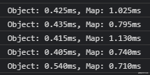
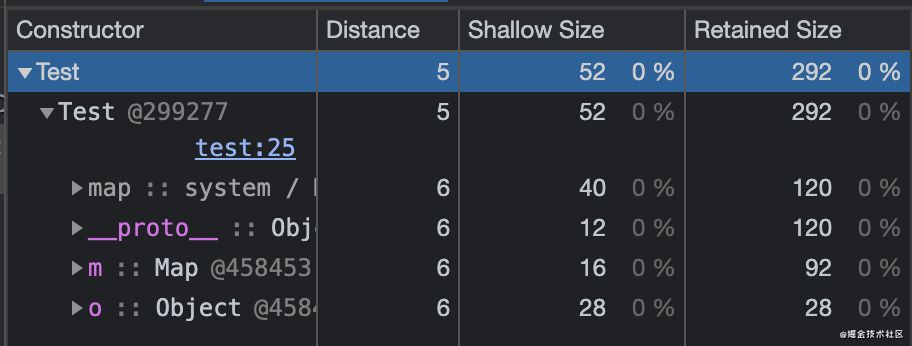
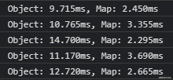
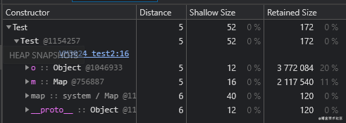
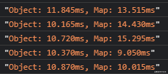
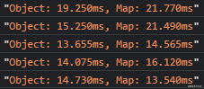
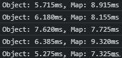
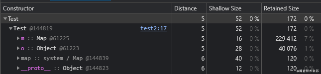

在日常的 JavaScript 项目中，我们最常用到的数据结构就是各种形式的键值对格式了（key-value pair）。在 JavaScript 中，除了最基础的 Object 是该格式外，ES6 新增的 Map 也同样是键值对格式。它们的用法在很多时候都十分接近。不知道有没有人和我一样纠结过该选择哪个去使用呢？在本菜最近的项目中，我又遇到了这样的烦恼，索性一不做二不休，去对比一下究竟该使用哪一个。

本文将会探讨一下 Object 和 Map 的不同，从多个角度对比一下 Object 和 Map：

- 用法的区别：在某些情况下的用法会截然不同
- 句法的区别：创建以及增删查改的句法区别
- 性能的区别：速度和内存占用情况

希望读完本文的你可以在日后的项目中做出更为合适的选择。

## 用法对比

- 对于 Object 而言，它键（key）的类型只能是字符串，数字或者 Symbol；而对于 Map 而言，它可以是任何类型。（包括 Date，Map，或者自定义对象）
- Map 中的元素会保持其插入时的顺序；而 Object 则不会完全保持插入时的顺序，而是根据如下规则进行排序:
  - 非负整数会最先被列出，排序是从小到大的数字顺序
  - 然后所有字符串，负整数，浮点数会被列出，顺序是根据插入的顺序
  - 最后才会列出 Symbol，Symbol 也是根据插入的顺序进行排序的
- 读取 Map 的长度很简单，只需要调用其 .size() 方法即可；而读取 Object 的长度则需要额外的计算： Object.keys(obj).length
- Map 是可迭代对象，所以其中的键值对是可以通过 for of 循环或 .foreach() 方法来迭代的；而普通的对象键值对则默认是不可迭代的，只能通过 for in 循环来访问（或者使用 Object.keys(o)、Object.values(o)、Object.entries(o) 来取得表示键或值的数字）迭代时的顺序就是上面提到的顺序。

```javascript
const o = {};
const m = new Map();
o[Symbol.iterator] !== undefined; // false
m[Symbol.iterator] !== undefined; // true
```

- 在 Map 中新增键时，不会覆盖其原型上的键；而在 Object 中新增键时，则有可能覆盖其原型上的键:

```javascript
Object.prototype.x = 1;
const o = { x: 2 };
const m = new Map([[x, 2]]);
o.x; // 2，x = 1 被覆盖了
m.x; // 1，x = 1 不会被覆盖
```

- JSON 默认支持 Object 而不支持 Map。若想要通过 JSON 传输 Map 则需要使用到 .toJSON() 方法，然后在 JSON.parse() 中传入复原函数来将其复原。对于 JSON 这里就不具体展开了，有兴趣的朋友可以看一下这：[JSON 的序列化和解析](https://juejin.cn/post/6931927132427780103#heading-5)

```javascript
const o = { x: 1 };
const m = new Map([["x", 1]]);
const o2 = JSON.parse(JSON.stringify(o)); // {x:1}
const m2 = JSON.parse(JSON.stringify(m)); // {}
```

## 句法对比

### 创建时的区别

**Obejct**

```javascript
const o = {}; // 对象字面量
const o = new Object(); // 调用构造函数
const o = Object.create(null); // 调用静态方法 Object.create
```

对于 Object 来说，我们在 95%+ 的情况下都会选择对象字面量，它不仅写起来最简单，而且相较于下面的函数调用，在性能方面会更为高效。对于构建函数，可能唯一使用到的情况就是显式的封装一个基本类型；而 Object.create 可以为对象设定原型。

**Map**

```javascript
const m = new Map(); // 调用构造函数
```

和 Object 不同，Map 没有那么多花里胡哨的创建方法，通常只会使用其构造函数来创建。

除了上述方法之外，我们也可以通过 Function.prototype.apply()、Function.prototype.call()、reflect.apply()、Reflect.construct() 方法来调用 Object 和 Map 的构造函数或者 Object.create() 方法，这里就不展开了。

### 新增/读取/删除元素时的区别

**Object**

```javascript
const o = {};
//新增/修改
o.x = 1;
o["y"] = 2;
//读取
o.x; // 1
o["y"]; // 2
//或者使用 ES2020 新增的条件属性访问表达式来读取
o?.x; // 1
o?.["y"]; // 2
//删除
delete o.b;
```

对于新增元素，看似使用第一种方法更为简单，不过它也有些许限制：

- 属性名不能包含空格和标点符号
- 属性名不能以数字开头

对于条件属性访问表达式的更多内容可以看一下这：[条件属性访问表达式](https://juejin.cn/post/6928565118129471496/#heading-5)

**Map**

```javascript
const m = new Map();
//新增/修改
m.set("x", 1);
//读取
map.get("x");
//删除
map.delete("b");
```

对于简单的增删查改来说，Map 上的方法使用起来也是十分便捷的；不过在进行联动操作时，Map 中的用法则会略显臃肿：

```javascript
const m = new Map([["x", 1]]);
// 若想要将 x 的值在原有基础上加一，我们需要这么做：
m.set("x", m.get("x") + 1);
m.get("x"); // 2

const o = { x: 1 };
// 在对象上修改则会简单许多：
o.x++;
o.x; // 2
```

## 性能对比

接下来我们来讨论一下 Object 和 Map 的性能。不知道各位有没有听说过 Map 的性能优于 Object 的说法，我反正是见过不少次，甚至在 JS 高程四中也提到了 Map 对比 Object 时性能的优势；不过对于性能的概括都十分的笼统，所以我打算做一些测试来对比一下它们的区别。

### 测试方法

在这里我进行的对于性能测试的都是基于 v8 引擎的。速度会通过 JS 标准库自带的 performance.now() 函数来判断，内存使用情况会通过 Chrome devtool 中的 memory 来查看。

对于速度测试，因为单一的操作速度太快了，很多时候 performance.now() 会返回 0。所以我进行了 10000 次的循环然后判断时间差。因为循环本身也会占据一部分时间，所以以下的测试只能作为一个大致的参考。

### 创建时的性能

测试用的代码如下：

```javascript
let n,
  n2 = 5;
// 速度
while (n2--) {
  let p1 = performance.now();
  n = 10000;
  while (n--) {
    let o = {};
  }
  let p2 = performance.now();
  n = 10000;
  while (n--) {
    let m = new Map();
  }
  let p3 = performance.now();
  console.log(
    `Object: ${(p2 - p1).toFixed(3)}ms, Map: ${(p3 - p2).toFixed(3)}ms`
  );
}
// 内存
class Test {}
let test = new Test();
test.o = o;
test.m = m;
```

首先进行对比的是创建 Object 和 Map 时的表现。对于创建的速度表现如下：



我们可以发现创建 Object 的速度会快于 Map。对于内存使用情况则如下：



我们主要关注其 Retained Size，它表示了为其分配的空间。（即删除时释放的内存大小）

通过对比我们可以发现，空的 Object 会比空的 Map 占用更少的内。所以这一轮 Object 赢得一筹。

### 新增元素时的性能

测试用的代码如下：

```javascript
console.clear();
let n,
  n2 = 5;
let o = {},
  m = new Map();
// 速度
while (n2--) {
  let p1 = performance.now();
  n = 10000;
  while (n--) {
    o[Math.random()] = Math.random();
  }
  let p2 = performance.now();
  n = 10000;
  while (n--) {
    m.set(Math.random(), Math.random());
  }
  let p3 = performance.now();
  console.log(
    `Object: ${(p2 - p1).toFixed(3)}ms, Map: ${(p3 - p2).toFixed(3)}ms`
  );
}
// 内存
class Test {}
let test = new Test();
test.o = o;
test.m = m;
```

对于新建元素时的速度表现如下：



我们可以发现新建元素时，Map 的速度会快于 Object。对于内存使用情况则如下：



通过对比我们可以发现，在拥有一定数量的元素时， Object 会比 Map 占用多了约 78% 的内存。我也进行了多次的测试，发现在拥有足够的元素时，这个百分比是十分稳定的。所以说，在需要进行很多新增操作，且需要储存许多数据的时候，使用 Map 会更高效。

### 读取元素时的性能

测试用的代码如下：

```javascript
let n;
let o = {},
  m = new Map();

n = 10000;
while (n--) {
  o[Math.random()] = Math.random();
}
n = 10000;
while (n--) {
  m.set(Math.random(), Math.random());
}

let p1 = performance.now();
for (key in o) {
  let k = o[key];
}
let p2 = performance.now();
for ([key] of m) {
  let k = m.get(key);
}
let p3 = performance.now();
`Object: ${(p2 - p1).toFixed(3)}ms, Map: ${(p3 - p2).toFixed(3)}ms`;
```

对于读取元素时的速度表现如下：



通过对比，我们可以发现 Object 略占优势，但总体差别不大。

### 删除元素时的性能

不知道大家是否听说过 delete 操作符性能低下，甚至有很多时候为了性能，会宁可将值设置为 undefined 而不使用 delete 操作符的说法。但其实在 v8 近来的优化下，它的效率已经提升许多了。

测试用的代码如下：

```javascript
let n;
let o = {},
  m = new Map();

n = 10000;
while (n--) {
  o[Math.random()] = Math.random();
}
n = 10000;
while (n--) {
  m.set(Math.random(), Math.random());
}

let p1 = performance.now();
for (key in o) {
  delete o[key];
}
let p2 = performance.now();
for ([key] of m) {
  m.delete(key);
}
let p3 = performance.now();
`Object: ${(p2 - p1).toFixed(3)}ms, Map: ${(p3 - p2).toFixed(3)}ms`;
```

对于删除元素时的速度表现如下：



我们可以发现在进行删除操作时，Map 的速度会略占优，但整体差别其实并不大。

### 特殊情况

其实除了最基本的情况之外，还有一种特殊的情况。还记得我们在前面提到的 Object 中键的排序吗？我们提到了其中的非负整数会被最先列出。其实对于非负整数作为键的值和其余类型作为键的值来说，v8 是会对它们进行区别对待的。负整数作为键的部分会被当成数组对待，即非负整数具有一定的连续性时，会被当成快数组，而过于稀疏时会被当成慢数组。

对于快数组，它拥有连续的内存，所以在进行读写时会更快，且占用更少的内存。更多的内容可以看一下这: [探究 JS V8 引擎下的“数组”底层实现](https://zhuanlan.zhihu.com/p/96959371)

在键为连续非负整数时，性能如下：




我们可以看到 Object 不仅平均速度更快了，其占用的内存也大大减少了。

## 总结

通过对比我们可以发现，Map 和 Object 各有千秋，对于不同的情况下，我们应当作出不同的选择。所以我总结了一下我认为使用 Map 和 Object 更为合适的时机。

使用 Map：

- 储存的键不是字符串/数字/或者 Symbol 时，选择 Map，因为 Object 并不支持
- 储存大量的数据时，选择 Map，因为它占用的内存更小
- 需要进行许多新增/删除元素的操作时，选择 Map，因为速度更快
- 需要保持插入时的顺序的话，选择 Map，因为 Object 会改变排序
- 需要迭代/遍历的话，选择 Map，因为它默认是可迭代对象，迭代更为便捷

使用 Object：

- 只是简单的数据结构时，选择 Object，因为它在数据少的时候占用内存更少，且新建时更为高效
- 需要用到 JSON 进行文件传输时，选择 Object，因为 JSON 不默认支持 Map
- 需要对多个键值进行运算时，选择 Object，因为句法更为简洁
- 需要覆盖原型上的键时，选择 Object

虽然 Map 在很多情况下会比 Object 更为高效，不过 Object 永远是 JS 中最基本的引用类型，它的作用也不仅仅是为了储存键值对。

> 作者：掘金开发者社区 <br>
> 原文：<https://zhuanlan.zhihu.com/p/358378689>
