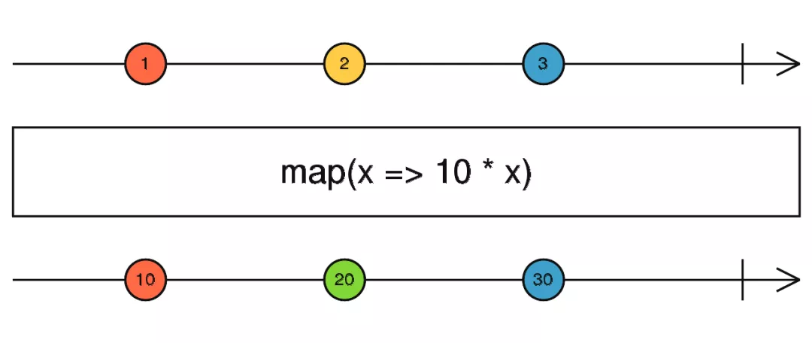
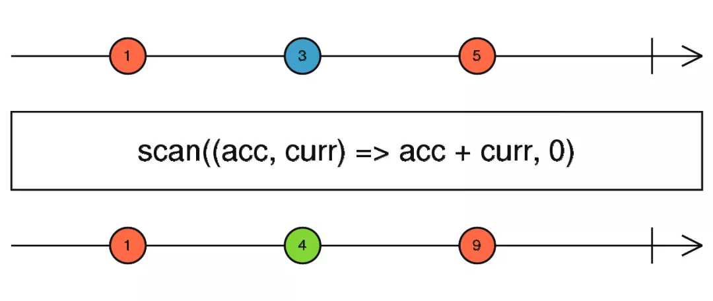
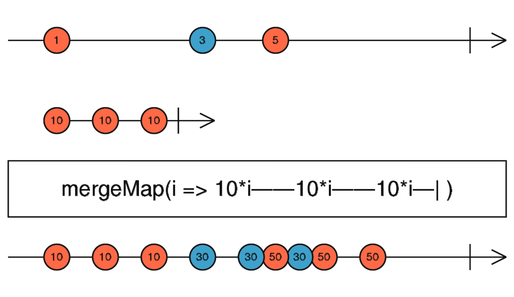
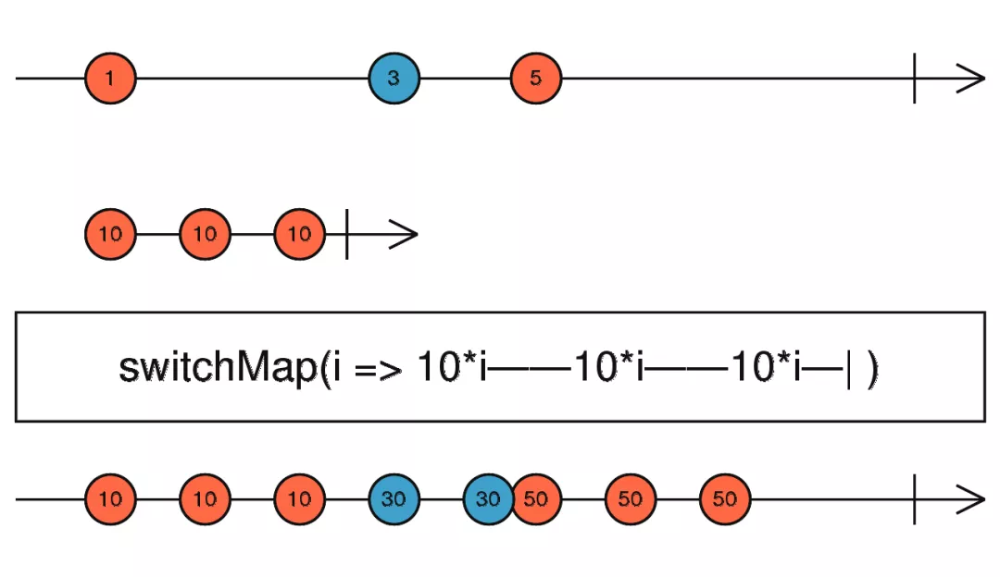
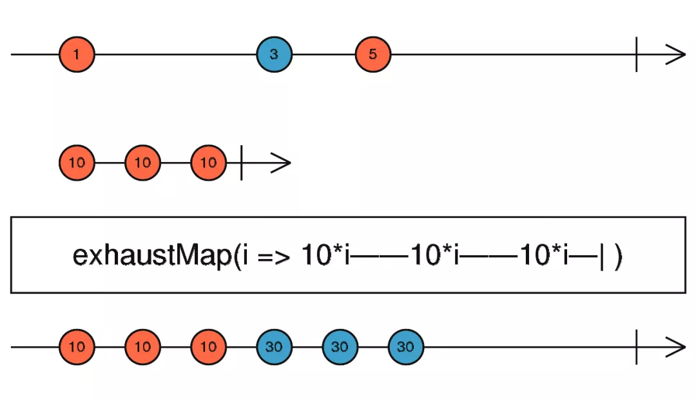
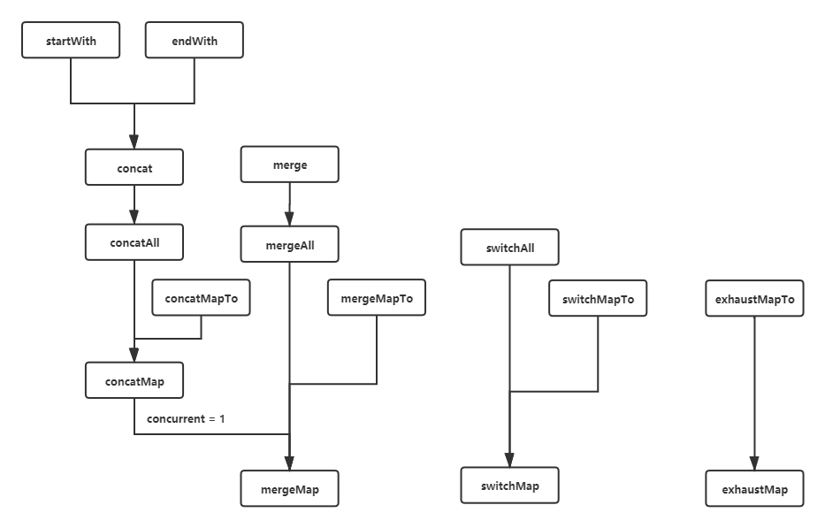
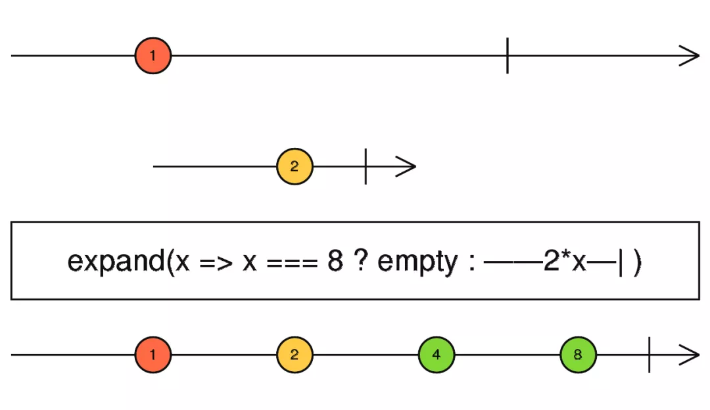
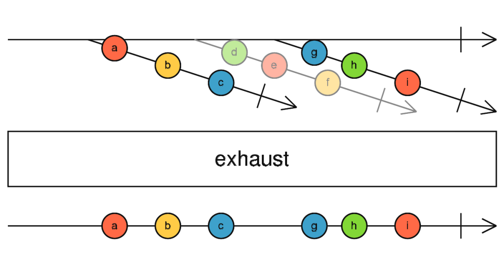

在本文开始之前，先定义一些自定义术语，方便阅读。

- 顶流：调用了操作符的流。
- 上游流：操作符的内部订阅器所订阅的流。
- 下游流：由操作符的内部订阅器管理的流。
- 终结订阅：订阅了操作符生成的流的订阅者。

在上一篇中，我描述了 OuterSubscriber 和 InnerSubscriber 的作用，并将几个 Join Creation Operator 的源码解析了一遍。下面，我们将进入的是 Transformation Operator 的源码分析。

在知道了 OuterSubscriber 和 InnerSubscriber 是一种通过委托模式实现管理下游流订阅的方法后，我发现其实这种实现技巧用于很多的 operators。那么本篇及下一篇将会介绍更多这种类似的设计。

## 基础映射

### map



map 是最为基础的映射，他将上游流的值经过运算，转发给下游订阅。这部分源码不是很复杂，实际上就是做了一层转发。

```typescript

protected _next(value: T) {
  let result: R;
  try {
    result = this.project.call(this.thisArg, value, this.count++);
  } catch (err) {
    this.destination.error(err);
    return;
  }
  this.destination.next(result);
}
```

### scan



Scan 和 的作用跟 reduce 一样，传入一个函数把一组数据打平，但是跟 reduce 不一样的点在于，每一次结合完毕都会立刻返回结果。

```typescript
const clicks1 = fromEvent(document, "click");
const ones1 = clicks.pipe(mapTo(1));
const seed1 = 0;
const count1 = ones.pipe(
  // 输入的是返回任意值的函数
  scan((acc, one) => acc + one, seed)
);
count.subscribe((x) => console.log(x));
```

这部分的实现同样也不是很复杂，在拿到上游流数据后，使用 `accumulator` 对数据进行累加操作。

```typescript
protected _next(value: T): void {
  // 需要判断是否带有初始值。
  if (!this.hasSeed) {
    this.seed = value;
    this.hasSeed = true;
    this.destination.next(value);
  } else {
      return this._tryNext(value);
    }
}

private _tryNext(value: T): void {
  const index = this.index++;
  let result: any;
  try {
      // 计算结果
    result = this.accumulator(<R>this.seed, value, index);
  } catch (err) {
    this.destination.error(err);
  }
    // 保存，以备下次使用
  this.seed = result;
  this.destination.next(result);
}
```

## 五种基础复合映射

*所谓复合映射，意思就是这些操作符接收的参数是一个带有上游流数据作为参数并返回 Observable 的函数，同时把其中的订阅数据转发给下游订阅。*

mergeMap，switchMap，exhaustMap，concatMap，mergeScan 是五种复合映射操作符，它使得上游流的数据可以传递给下游流，并交由其处理。concatMap 和 mergeScan 是 mergeMap 的特殊情况，所以我们只需要关注剩余的三种。

mergeMap，switchMap，exhaustMap，这三种操作符的源码结构分为这三个部分：

- 通过 lift 操作，将原有的流映射成新的流。
- 实现 Operator 接口，通过 call 返回一个 Subscriber。
- 通过继承 OuterSubscriber 实现这个 Subscriber。

其中，前两个部分都拥有非常类似的结构，都是通过这种样板代码来进行编写。

```typescript
export function someMap<T, R, O extends ObservableInput<any>>(
  project: (value: T, index: number) => O
): OperatorFunction<T, ObservedValueOf<O> | R> {
  return (source: Observable<T>) => source.lift(new SomeMapOperator(project));
}

class SomeMapOperator<T, R> implements Operator<T, R> {
  constructor(
    private project: (value: T, index: number) => ObservableInput<R>
  ) {}

  call(Subscriber: Subscriber<R>, source: any): any {
    return source.subscribe(new SomeMapSubscriber(Subscriber, this.project));
  }
}
```

通过 _innerSub 提供的内部注册方法，在里面创建 InnerSubscriber，并传入当前的 OuterSubscriber 。

```typescript

private _innerSub(input: ObservableInput<R>, value: T, index: number): void {
  const innerSubscriber = new InnerSubscriber(this, value, index);
  const destination = this.destination as Subscription;
  destination.add(innerSubscriber);
  const innerSubscription = subscribeToResult<T, R>(this, input, undefined, undefined, innerSubscriber);

  // 因为这里的 input 可能不是 observable， 那么返回的
  // 订阅结果也可能跟 innserSubscriber 相等，所以这里要
  // 处理一下。
  if (innerSubscription !== innerSubscriber) {
    destination.add(innerSubscription);
  }
}
```

最终，交由 subscribeToResult 创建一个内部订阅来管理下游流。

### mergeMap



mergeMap 提供的是一种合并操作，通过在内部维护了多个下游流的订阅，使得上游流可以将数据下发给多个下游流。它提供了一个并发数限制的参数，主要用于控制下游流并发的数量。

```typescript
export function mergeMap<T, R, O extends ObservableInput<any>>(
  project: (value: T, index: number) => O,
  concurrent: number = Number.POSITIVE_INFINITY
): OperatorFunction<T, ObservedValueOf<O> | R> {
  return (source: Observable<T>) =>
    source.lift(new MergeMapOperator(project, concurrent));
}
```

下面，我们关注的点将转移到 MergeMapSubscriber 。首先看看它的数据结构。

```typescript
export class MergeMapSubscriber<T, R> extends OuterSubscriber<T, R> {
  // 标记是否已经完成
  private hasCompleted: boolean = false;
  // 上流 observable 的数据缓存
  private buffer: T[] = [];
  // 当前正在开启的流的数量
  private active: number = 0;
  // 数据的索引
  protected index: number = 0;

  constructor(
    // 外部传入的订阅者
    destination: Subscriber<R>,
    // 需要合并的 Observable 的工厂
    private project: (value: T, index: number) => ObservableInput<R>,
    // 并发数量
    private concurrent: number = Number.POSITIVE_INFINITY,
) {
    super(destination);
  }
  ...
}
```

#### Subscriber

MergeMapSubscriber 的 \_next 调用的时候，会比较 active （下游流的数量） 与 concurrent （最大并发数）的大小，active 小于 concurrent 则调用 \_tryNext，否则将已经到来的数据放入缓冲区中，但是你知道的， JavaScript 并没有真正的并发，这就是一个异步队列。而每一次进行 \_tryNext，都会通过 project 来创建一个下游流，同时让更新 active，将下游流传入并触发 \_innerSub。

```typescript

protected _next(value: T): void {
  if (this.active < this.concurrent) {
    this._tryNext(value);
  } else {
    this.buffer.push(value);
  }
}

protected _tryNext(value: T) {
  let result: ObservableInput<R>;
  const index = this.index++;
  try {
    result = this.project(value, index);
  } catch (err) {
    this.destination.error(err);
    return;
  }
  this.active++;
  //
  this._innerSub(result, value, index);
}
```

在上游流完成时，会触发 _complete。

```typescript
protected _complete(): void {
  this.hasCompleted = true;
  if (this.active === 0 && this.buffer.length === 0) {
    this.destination.complete();
  }
  this.unsubscribe();
}
```

如果所有的下游流都已经完成，且缓冲区中没有数据，则通知下游订阅数据已经输出完毕。

#### notify

notifyNext 就是单纯的将结果传递给下游订阅，而 notifyComplete 则有意思多了。

通过 notifyComplete ，可以得知哪些流已经完成任务并且关闭。如果 buffer 中存在数据，那么将数据交由 \_next 发送出去并创建新的下游流。过这种递归操作，可以将所有 buffer 中的数据都发送出去。最后判断上游流和下游流是不是都已经结束了，如果已经结束了，则通知下游订阅数据已经输出完毕。

```typescript

notifyNext(
  outerValue: T, innerValue: R,
  outerIndex: number, innerIndex: number,
  innerSub: InnerSubscriber<T, R>
): void {
  this.destination.next(innerValue);
}

notifyComplete(innerSub: Subscription): void {
  const buffer = this.buffer;
  this.remove(innerSub);
  this.active--;
  if (buffer.length > 0) {
    this._next(buffer.shift());
  } else if (this.active === 0 && this.hasCompleted) {
    this.destination.complete();
  }
}
```

### switchMap



switchMap 提供的是一个上游流为主的映射操作，当上游流的订阅数据到来的时候，旧的下游流会被取消订阅，然后重新订阅一组新的下游流。

```typescript
export function switchMap<T, R, O extends ObservableInput<any>>(
  project: (value: T, index: number) => O
): OperatorFunction<T, ObservedValueOf<O> | R> {
  return (source: Observable<T>) => source.lift(new SwitchMapOperator(project));
}
```

#### Subscriber

innerSubscription 保存了当前下游流的订阅，所以这个操作符只会维护一个下游流的订阅。

```typescript
private index: number = 0;
private innerSubscription: Subscription;
```

当进行 next 操作的时候，会先创建新的下游流，如果旧的下游流存在，那么会被取消订阅。

```typescript
protected _next(value: T) {
  let result: ObservableInput<R>;
  const index = this.index++;
  try {
    // 上游流的数据到来了，创建新的下游流。
    result = this.project(value, index);
  } catch (error) {
    this.destination.error(error);
    return;
  }

  // 旧的下游流取消订阅
  const innerSubscription = this.innerSubscription;
  if (innerSubscription) {
    innerSubscription.unsubscribe();
  }

  this._innerSub(result, value, index);
}
```

该 Subscriber 重写了_complete 。这里意味着上游流已经输出完毕，那么如果下游订阅

```typescript

protected _complete(): void {
  const {innerSubscription} = this;
  if (!innerSubscription || innerSubscription.closed) {
    super._complete();
    return;
  }
  this.unsubscribe();
}
```

#### notify

跟之前一样， notifyNext 依旧是将下游流中的数据转发出去。主要关注点还是在于 notifyComplete。因为 innerSubscription 被置为空了，所以调用 this.\_complete 无意义，不会触发到其父类函数。

```typescript
notifyComplete(innerSub: Subscription): void {
  const destination = this.destination as Subscription;
  destination.remove(innerSub);
  this.innerSubscription = null;
  if (this.isStopped) {
    super._complete();
  }
}
```

如果当前的下游流已经完成了，那么就要将它从下游订阅（destination）中移除，如果上游流已经停止（error 或者 complete 被调用，或者被取消订阅），那么还得调用 super.\_complete 表示已经完成。

### exhaustMap



跟 switchMap 相反， exhaustMap 提供了一种以下游流为主的映射操作。如果下游流已经开启，那么上游流之后到来的订阅数据都将会被抛弃，直到该下游流完成订阅。下游流完成订阅后，上游流的数据才会继续跟新的下游流结合，并形成新的订阅。

```typescript
export function exhaustMap<T, R, O extends ObservableInput<any>>(
  project: (value: T, index: number) => O
): OperatorFunction<T, ObservedValueOf<O> | R> {
  return (source: Observable<T>) =>
    source.lift(new ExhaustMapOperator(project));
}
```

#### Subscriber

exhaustMap 的实现很简单，通过维护 hasSubscription 这样一个内部状态，标记下游流是否被订阅了。hasCompleted 则是上游流完成情况的标记。

```typescript
private hasSubscription = false;
private hasCompleted = false;
```

订阅会调用 \_next，标记下游流是否已经开启（订阅是否已经存在），如果未开启，则构建新的下游流，并标记 hasSubscription 为 true。

```typescript
protected _next(value: T): void {
  if (!this.hasSubscription) {
      let result: ObservableInput<R>;
      const index = this.index++;
      try {
        result = this.project(value, index);
      } catch (err) {
        this.destination.error(err);
        return;
      }
      // 标记为 true
      this.hasSubscription = true;
      this._innerSub(result, value, index);
  }
}
```

上游流和下游流的数据都已经输出完毕了，那么把完成信号传递给下游订阅。

```typescript
protected _complete(): void {
  this.hasCompleted = true;
  if (!this.hasSubscription) {
    this.destination.complete();
  }
  this.unsubscribe();
}
```

#### notify

如果下游流的数据输出完毕，那么就应该要将 hasSubscription 标记为 false。

```typescript

notifyComplete(innerSub: Subscription): void {
  const destination = this.destination as Subscription;
  destination.remove(innerSub);

  // 标记为 false
  this.hasSubscription = false;

  // 此处判断上游流是否已经完成
  if (this.hasCompleted) {
    this.destination.complete();
  }
}
```

### concatMap

concatMap 是 mergeMap 的一种特殊形式。

```typescript
export function concatMap<T, R, O extends ObservableInput<any>>(
  project: (value: T, index: number) => O
): OperatorFunction<T, ObservedValueOf<O> | R> {
  return mergeMap(project, 1);
}
```

### mergeScan

mergeScan 的源码跟 mergeMap 类似。只不过就是把传入的函数替换了一下，并且在内部缓存了上一个结合后的值。

```typescript
const clicks2 = fromEvent(document, "click");
const ones2 = click$.pipe(mapTo(1));
const seed2 = 0;
const count2 = one$.pipe(
  // 输入一个 Observable 工厂
  mergeScan((acc, one) => of(acc + one), seed)
);
```

### concat & merge

上一篇中，关于 concat 和 merge 两个相关的 operators 并没有讲到，因为这它们其实最终都是调用 mergeMap。

### 小结

通过这三个不同的映射操作符，使得上游流可以通过一定的方式跟下游流结合。那么，结合一张图，可以看看相关操作符的关系。



对这些操作符分一下类:

- 属于 Transformation Operators 的有：concatMap， concatMapTo， mergeMap， mergeMapTo， switchMap，switchMapTo，exhaustMap，exhaustMapTo。
- 属于 Join Creation Operators 的有：merge, concat。
- 属于 Join Operators 的有：mergeAll， concatAll， switchAll， startWith，endWith。

## 零散的高阶操作符

### expand



expand 将传入的 Observable 工厂进行递归操作。与上面的复合映射类似，expand 也是一种复合映射，只不过，他会不断的去复合下游流的数据，也就是类似上图的模式。

#### Subscriber

为了实现相对应的功能，expand 定义了以下数据结构。

```typescript
export class ExpandSubscriber<T, R> extends OuterSubscriber<T, R> {
    // 当前索引
    private index: number = 0;
    // 已启动的下游流的数量
    private active: number = 0;
    // 上游流是否已经完成
    private hasCompleted: boolean = false;
    // 对于索引的缓存数据
    private buffer: any[];
    // 下游流工厂
    private project: (value: T, index: number) => ObservableInput<R>,
    // 并发数
    private concurrent: number;
}
```

上游流数据到来的时候，跟 mergeMap 比较类似，也会比较 active 和 concurrent，如果 active 大于 concurrent ，那么便会用 buffer 缓存上游流的数据，如果 active 小于 concurrent ，那么直接发送数据给到下游订阅，并订阅一个新的下游流。需要注意的一点，为了防止爆栈，expand 在这里加了一个判断条件，在 notify 中，将利用这一条件，来结束递归。

```typescript

protected _next(value: any): void {
  const destination = this.destination;

  if (destination.closed) {
    this._complete();
    return;
  }

  const index = this.index++;
  if (this.active < this.concurrent) {
    destination.next(value);
    try {
      const { project } = this;
      const result = project(value, index);
      this.subscribeToProjection(result, value, index);
    } catch (e) {
      destination.error(e);
    }
  } else {
    this.buffer.push(value);
  }
}
// 订阅新的下游流
private subscribeToProjection(result: any, value: T, index: number): void {
  this.active++;
  const destination = this.destination as Subscription;
  destination.add(subscribeToResult<T, R>(this, result, value, index));
}
```

当上游流完成时，需要标记 hasComplete 为 true。这一步是结束递归的重要标志。

```typescript

protected _complete(): void {
  this.hasCompleted = true;
  if (this.hasCompleted && this.active === 0) {
    this.destination.complete();
  }
    this.unsubscribe();
}
```

#### notify

那么 expand 是怎么构成递归的呢，当下游流有数据到来的时候，他会直接调用 \_next。最终形成了 \_next -> subscribeToProjection -> next -> notifyNext -> \_next 这样的一条递归链。

```typescript

notifyNext(
  outerValue: T,
  innerValue: R,
    outerIndex: number,
  innerIndex: number,
    innerSub: InnerSubscriber<T, R>
): void {
    this._next(innerValue);
}
```

下游流完成时，需要根据 hasCompleted 和 buffer 的状态来决定是否结束递归。在这里，也形成了一条这样的递归链： \_next -> subscribeToProjection -> next -> notifyComplete -> \_next 。

```typescript
notifyComplete(innerSub: Subscription): void {
  const buffer = this.buffer;
  const destination = this.destination as Subscription;
  destination.remove(innerSub);
  this.active--;
  if (buffer && buffer.length > 0) {
    this._next(buffer.shift());
  }
  if (this.hasCompleted && this.active === 0) {
    this.destination.complete();
  }
}
```

### exhaust



exhaust 是一种打平操作，它的源码并没有调用 exhaustMap。它的实现思路很简单，通过判断当前是否存在前一个下游流订阅（hasSubscription），来决定当前到来的下游流是否开启。

```typescript
private hasCompleted: boolean = false;
private hasSubscription: boolean = false;


protected _next(value: T): void {
  // 如果存在订阅，那么抛弃这个值
  if (!this.hasSubscription) {
    this.hasSubscription = true;
    this.add(subscribeToResult(this, value));
  }
}

protected _complete(): void {
  this.hasCompleted = true;
  if (!this.hasSubscription) {
    this.destination.complete();
  }
}

notifyComplete(innerSub: Subscription): void {
  this.remove(innerSub);
  this.hasSubscription = false;
  if (this.hasCompleted) {
    this.destination.complete();
  }
}
```

> 作者：zcx <br>
> 原文：<https://mp.weixin.qq.com/s/lrawMOuHNj6GyQJMqK1Now>