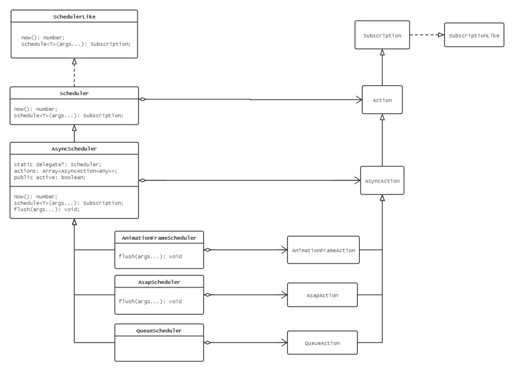

在这之前，我一直都没有讲过 Scheduler 的作用，那么本章就开始讲解 Scheduler 的设计思路和基本结构。RxJS 的存在是为了处理异步 IO，而异步 IO 所包含的一系列 API 肯定也是要经过进一步的封装才能让 RxJS 中的异步操作使用。



可以看到，它主要还是根据 JS 的所能够提供的异步能力来设计这些基本结构。

- AsyncScheduler 异步调度器，使用 `setInterval` 实现。
- QueueScheduler 队列异步调度器，继承了 `AsyncScheduler`，但是 `QueueAction` 是一种链式结构，使得调度以迭代器的形式进行。
- AnimationFrameScheduler 使用 `reqeustAnimationFrame` 实现了帧调度器。
- AsapScheduler 使用 `Promise.resolve().then()` 实现的微任务调度器。

## SchedulerLike 、 Scheduler & Action

首先，SchedulerLike 提供了以下两个接口。

```typescript
export interface SchedulerLike {
  // 标记当前时间
  now(): number;

  // 开启调度的基础接口
  schedule<T>(
    work: (this: SchedulerAction<T>, state?: T) => void,
    delay?: number,
    state?: T
  ): Subscription;
}
```

Scheduler 则实现了这些接口。

```typescript
export class Scheduler implements SchedulerLike {
  // 获取当前时间戳
  public static now: () => number = () => Date.now();

  constructor(
    private SchedulerAction: typeof Action,
    now: () => number = Scheduler.now
  ) {
    this.now = now;
  }

  public now: () => number;
  // 直接调用 action 的 schedule
  public schedule<T>(
    work: (this: SchedulerAction<T>, state?: T) => void,
    delay: number = 0,
    state?: T
  ): Subscription {
    return new this.SchedulerAction<T>(this, work).schedule(state, delay);
  }
}
```

Scheduler 为后续的继承它的调度器定义了创建方式，通过传入一个 Action 工厂，使得内部可以构造特定的 Action 。而 Action 继承了 Subscription，意味着 Action 实际上是一种的订阅器。

```typescript
export class Action<T> extends Subscription {
  constructor(
    scheduler: Scheduler,
    work: (this: SchedulerAction<T>, state?: T) => void
  ) {
    super();
  }
  // Action 开始调度
  public schedule(state?: T, delay: number = 0): Subscription {
    return this;
  }
}
```

上面的设计是一种名为 `Template Method` 的设计模式，这种方法有效地约束了后续的不同的 Scheduler 的实现。

> 定义一个操作中的算法的骨架，而将一些步骤延迟到子类中。它使得子类可以不改变一个算法的结构即可重定义该算法的某些特定步骤。

## 异步调度器

先来了解一下 Scheduler 的子类 AsyncScheduler，余下所有的 Scheduler 都会继承它。在这里，先不急着进行源码分析，我们需要先为了弄清楚调度器的运行原理，了解调度器是如何对异步 API 进行封装的。

首先，调度器本身也是基于观察者模式来进行设计，但是它又独立于 Rxjs 的 Observable。一般来说， AsyncScheduler 是这样调用的。

```typescript
const scheduler = AsyncScheduler(AsyncAction);
const subscription = async.schedule(
  function (counter) {
    console.log(counter);
    // this 绑定了 AsyncAction
    this.schedule(counter + 1, 1000);
  },
  1000,
  1
);

// subscription.unsubscribe();
```

它的调用栈是这样的。

```typescript
AsyncScheduler.schedule;
AsyncAction.schedule;
AsyncAction.requestAsyncId;
listOnTimeout; // 原生事件
processTimers; // 原生事件
AsyncScheduler.flush;
AsyncAction.execute;
AsyncAction._execute;
AsyncAction.work;
```

### AsyncAction.schedule

跟着调用栈分析源码来溯源，在 AsyncScheduler 的 `schedule` 方法中，它先构造了 AsyncAction ，然后调用它的 `schedule` 。在这个方法中，实际上是对 Action 的内部状态进行更新，所以此处关注的地方就是在于 `schedule` 如何触发异步 API。

```typescript
class AsyncAction<T> extends Action<T> {
  constructor(
    protected scheduler: AsyncScheduler,
    protected work: (this: SchedulerAction<T>, state?: T) => void
  ) {
    super(scheduler, work);
  }

  public schedule(state?: T, delay: number = 0): Subscription {
    if (this.closed) {
      return this;
    }
    this.state = state;
    const id = this.id;
    const scheduler = this.scheduler;
    // 需要对相应的异步 API 进行取消操作
    if (id != null) {
      this.id = this.recycleAsyncId(scheduler, id, delay);
    }
    this.pending = true;
    this.delay = delay;
    // 重新配置异步 API
    this.id = this.id || this.requestAsyncId(scheduler, this.id, delay);

    return this;
  }
}
```

可以看到，从 scheduler 传入的回调函数最终会被 Action 持有，所以调用栈最终执行的 `work` 实际上就是回调函数。

### AsyncAction.requestAsyncId

`requestAsyncId` 是调用异步 API 的方法，这个方法在 AsyncAction 最终触发了 `setInterval` 这一异步 API。那么实际上，根据 Template Method 的设计，所有继承 AsyncAction 的 Action 都会通过这个方法实现相对应的异步 API 。

至于 AsyncAction 为什么会使用 `setInterval` 而不是 `setTimeout`，源代码里是这样说明的。

> Actions only execute once by default, unless rescheduled from within the scheduled callback. This allows us to implement single and repeat actions via the same code path, without adding API surface area, as well as mimic traditional recursion but across asynchronous boundaries. However, JS runtimes and timers distinguish between intervals achieved by serial setTimeout calls vs. a single setInterval call. An interval of serial setTimeout calls can be individufenally delayed, which delays scheduling the next setTimeout, and so on. setInterval attempts to guarantee the interval callback will be invoked more precisely to the interval period, regardless of load. Therefore, we use setInterval to schedule single and repeat actions. If the action reschedules itself with the same delay, the interval is not canceled. If the action doesn't reschedule, or reschedules with a different delay, the interval will be canceled after scheduled callback execution.

> 对于某一个 Action 来说，除非它在调度的回调中被重新调度，那么它默认只会执行一次。这样的方式可以使得我们通过统一的代码实现调度单一或重复的 Actions，而无需添加 API，并且可以模仿传统递归来扩展异步。然而， JS 的运行时或者计时器分别通过串行的 setTimout 或者是单个 setInterval 来获取调用的定时器。串行的 setTimout 定时器可以单独延迟，这样做会延迟 c 下一个 setTimout 的调度，以此类推。而 setInterval 则不管程序运行的负载如何，它总是尝试去确保每一次定时器的回调更加精准的安排到合适的间隔时间。因此，我们使用 setInterval 来安排单一或重复的 Actions，如果 action 以相同的时延调度本身，那么当前定时器不会被取消。如果 action 只没有重新调度或者以不同的时延重新调度，则安排的回调执行后，改定时器会被取消。

```typescript
class AsyncAction<T> extends Action<T> {
  protected requestAsyncId(
    scheduler: AsyncScheduler,
    id?: any,
    delay: number = 0
  ): any {
    // 绑定 scheduler，并且把当前的 AsyncAction 当作参数传入。
    return setInterval(scheduler.flush.bind(scheduler, this), delay);
  }
}
```

### AsyncScheduler.flush

所以，在 AsyncScheduler 中，新增的 `flush` 方法实际上是为 setInterval 服务的，它作为异步 API 的回调函数，主要步骤如下。

- 如果存在运行中的 Action ，它会保存所用调用它的 Action。
- 如果不存在运行中的 Action，它会执行所有调用队列中的 Action.execute
- 处理 Action.execute 的运行错误。

```typescript
export class AsyncScheduler extends Scheduler {
  public flush(action: AsyncAction<any>): void {
    const { actions } = this;

    if (this.active) {
      // 使用了一个队列保存所有输入的 Actions
      actions.push(action);
      return;
    }

    let error: any;
    this.active = true;
    // 默认 action 也是队列中的一员
    // 将所有队列中的 Action 进行调用。
    do {
      if ((error = action.execute(action.state, action.delay))) {
        break;
      }
    } while ((action = actions.shift()));

    this.active = false;

    // 出现错误时，取消所有未运行 action 的订阅
    if (error) {
      // 注意，此处不会重复取消订阅，因为执行错误的Action会先退出队列，再执行循环。
      while ((action = actions.shift())) {
        action.unsubscribe();
      }
      throw error;
    }
  }
}
```

### AsyncAction.execute

上述的 flush 调用了 action 的 execute 方法。该方法也是通过处理 action 的内部状态来获得执行结果，其中会调用 \_execute 这一内部方法，这个内部方法主要作用是调用 AsyncAction.work ，并处理它出现的异常。

```typescript
class AsyncAction<T> extends Action<T> {
  public execute(state: T, delay: number): any {
    if (this.closed) {
      return new Error("executing a cancelled action");
    }
    this.pending = false;
    // 获取异常错误
    const error = this._execute(state, delay);
    if (error) {
      return error;
    } else if (this.pending === false && this.id != null) {
      this.id = this.recycleAsyncId(this.scheduler, this.id, null);
    }
  }

  protected _execute(state: T, delay: number): any {
    let errored: boolean = false;
    let errorValue: any = undefined;
    try {
      // work
      this.work(state);
    } catch (e) {
      errored = true;
      errorValue = (!!e && e) || new Error(e);
    }
    if (errored) {
      this.unsubscribe();
      return errorValue;
    }
  }
}
```

### AsyncAction.recycleAsyncId

在分析到 Action.schedule 的时候，引用了源码内部的注释，其中有一句话很重要，那就是 “如果 action 以相同的时延调度本身，那么当前定时器不会被取消”，所以 recycleAsyncId 这个方法是需要处理这种情况。

```typescript
class AsyncAction<T> extends Action<T> {
  protected recycleAsyncId(
    scheduler: AsyncScheduler,
    id: any,
    delay: number = 0
  ): any {
    // this.delay === delay 处理了这种情况。
    if (delay !== null && this.delay === delay && this.pending === false) {
      return id;
    }
    // 取消当前的定时器
    clearInterval(id);
    return undefined;
  }
}
```

### 运用 Template Method

AsyncScheduler 可以说已经把所有的地基都打好了，它可以直接拿来用，也可以继承并重写一些相关的接口把相应的异步 API 进行替换。

## 队列调度器

队列调度器根据调用者传入的时延来决定使用同步方式的调度还是 setInterval 方式的调度。

QueueScheduler 单纯继承了 AsyncScheduler，其主要实现在 QueueAction 中，通过重写 `schedule` 、 `execute` 以及 `requestAsyncId` 等方法来实现这种功能。

```typescript
export class QueueAction<T> extends AsyncAction<T> {
  public schedule(state?: T, delay: number = 0): Subscription {
    // delay > 0 ，执行异步调度
    if (delay > 0) {
      return super.schedule(state, delay);
    }
    this.delay = delay;
    this.state = state;
    // 否则直接执行同步调度
    this.scheduler.flush(this);
    return this;
  }

  public execute(state: T, delay: number): any {
    // 根据传入的 delay 判断是否直接执行 work （同步执行）
    return delay > 0 || this.closed
      ? super.execute(state, delay)
      : this._execute(state, delay);
  }

  protected requestAsyncId(
    scheduler: QueueScheduler,
    id?: any,
    delay: number = 0
  ): any {
    // 根据传入的 delay 以及本身的 delay 来决定是否使用异步
    if ((delay !== null && delay > 0) || (delay === null && this.delay > 0)) {
      return super.requestAsyncId(scheduler, id, delay);
    }
    // delay 为 0，直接同步调度
    return scheduler.flush(this);
  }
}
```

## 帧调度器 与 微任务调度器

帧调度器根据调用者传入的时延来决定使用 `requestAnimationFrame` 还是 `setInterval` ，微任务调度器则是根据时延来决定使用 `Promise.reslove().then()` 还是 `setInterval`。

两者的调用类似，以至于可以结合起来分析。

### Action

它们的 action 方法均重写了 `requestAsyncId` 和 `recycleAsyncId`， 主要还是为了处理不同异步 API 。

```typescript

protected requestAsyncId(scheduler: AnimationFrameScheduler, id?: any, delay: number = 0): any {
  if (delay !== null && delay > 0) {
    return super.requestAsyncId(scheduler, id, delay);
  }
  // 把当前action 加入到 actions 队列末端
  scheduler.actions.push(this);

  if (!scheduler.scheduled) {
      // AsapAction 的情况
      const scheduled = Immediate.setImmediate(scheduler.flush.bind(scheduler, null));

      // AnimationFrameAction 的情况
      const scheduled = requestAnimationFrame(scheduler.flush.bind(scheduler, null));

      scheduler.scheduled = scheduled;
  }
  return scheduler.scheduled;
}

protected recycleAsyncId(scheduler: AnimationFrameScheduler, id?: any, delay: number = 0): any {
  if ((delay !== null && delay > 0) || (delay === null && this.delay > 0)) {
    return super.recycleAsyncId(scheduler, id, delay);
  }
  if (scheduler.actions.length === 0) {
    // AsapAction
    Immediate.clearImmediate(id);
    // AnimationFrameAction
    cancelAnimationFrame(id);

    scheduler.scheduled = undefined;
  }
  return undefined;
}
```

### Scheduler

它们的 flush，跟 AsyncScheduler 的 flush 实现思路差不多，依旧是轮询 actions 队列调用 action.execute ，只是它们的 flush 需要去处理额外的以下细节。

- action 传入可能为空。
- 处理 actions 的状态。
- 清空 scheduled，使得 scheduler 能够进行下一次调度。

```typescript
// export class AnimationFrameScheduler extends AsyncScheduler {
export class AsapScheduler extends AsyncScheduler {
  public flush(action?: AsyncAction<any>): void {
    this.active = true;
    this.scheduled = undefined;

    const { actions } = this;
    let error: any;
    let index: number = -1;
    // 此处顺序不能打乱，因为这样
    action = action || actions.shift()!;
    let count: number = actions.length;

    do {
      if ((error = action.execute(action.state, action.delay))) {
        break;
      }
    } while (++index < count && (action = actions.shift()));

    this.active = false;

    if (error) {
      while (++index < count && (action = actions.shift())) {
        action.unsubscribe();
      }
      throw error;
    }
  }
}
```

### Immediate

这里很有意思的一点， AsapScheduler 并没有直接通过 `Promise.reslove().then()` 来实现。而是把它封装成 `Immediate`，形成 `setImmediate` 和 `clearImmediate` 两个 API ，这样就使得微任务的调用其他的定时 API 无异。

内部实现是通过一个 Map 保存标记当前的是第几个微任务，这里并不直接保存 Promise，因为 Promise 执行完毕后就自行释放了，所以它需要的只是一个标记。

```typescript
let nextHandle = 1;
const RESOLVED = (() => Promise.resolve())();
const activeHandles: { [key: number]: any } = {};

function findAndClearHandle(handle: number): boolean {
  if (handle in activeHandles) {
    delete activeHandles[handle];
    return true;
  }
  return false;
}

export const Immediate = {
  setImmediate(cb: () => void): number {
    const handle = nextHandle++;
    activeHandles[handle] = true;
    RESOLVED.then(() => findAndClearHandle(handle) && cb());
    return handle;
  },

  clearImmediate(handle: number): void {
    findAndClearHandle(handle);
  },
};
```

## 总结

本篇分析了 RxJS 的调度器相关的一系列内容，通过封装 JS 异步 API ，调度器实现相对应的异步功能，增强了 RxJS 对异步 IO 的掌控。

> 作者：zcx <br>
> 原文：<https://mp.weixin.qq.com/s/vG0aaQmDy7Cqfv0CwJ_d0Q>