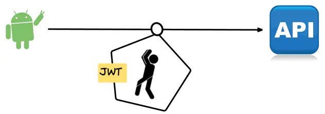
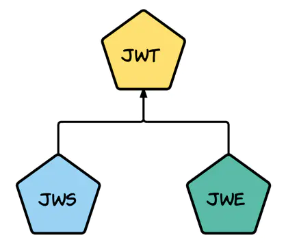
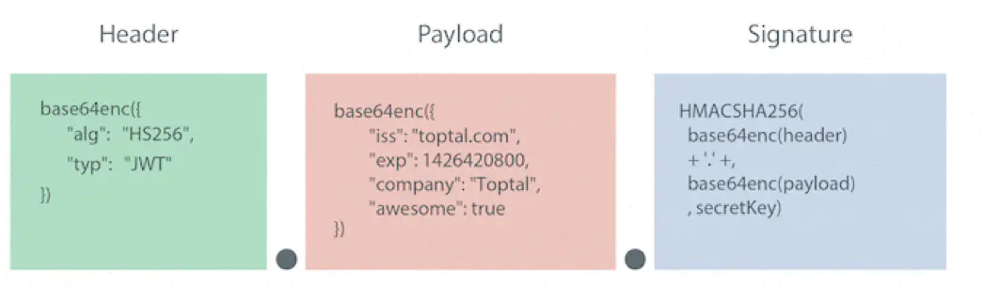
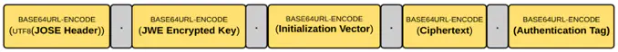

随着移动互联网的兴起，传统基于 session/cookie 的 web 网站认证方式转变为了基于 OAuth2 等开放授权协议的单点登录模式（SSO），相应的基于服务器 session+ 浏览器 cookie 的 Auth 手段也发生了转变，Json Web Token 出现成为了当前的热门的 Token Auth 机制。

## Json Web Token(JWT)

JSON Web Token（JWT）是一个非常轻巧的规范。这个规范允许我们使用 JWT 在两个组织之间传递安全可靠的信息。

> 官方定义: JSON Web Token (JWT) is a compact URL-safe means of representing claims to be transferred between two parties

现在网上大多数介绍 JWT 的文章实际介绍的都是 JWS(JSON Web Signature)，也往往导致了人们对于 JWT 的误解，但是 JWT 并不等于 JWS，JWS 只是 JWT 的一种实现，除了 JWS 外，JWE(JSON Web Encryption)也是 JWT 的一种实现。

下面就来详细介绍一下 JWT 与 JWE 的两种实现方式：

## JSON Web Signature(JWS)

JSON Web Signature 是一个有着简单的统一表达形式的字符串：

### 头部 (Header)

头部用于描述关于该 JWT 的最基本的信息，例如其类型以及签名所用的算法等。

JSON 内容要经 Base64 编码生成字符串成为 Header。

### 载荷（PayLoad）

payload 的五个字段都是由 JWT 的标准所定义的。

- iss(issuer): 签发人
- exp (expiration time)：过期时间
- sub (subject)：主题
- aud (audience)：受众
- nbf (Not Before)：生效时间
- iat (Issued At)：签发时间
- jti (JWT ID)：编号

JSON 内容要经 Base64 编码生成字符串成为 PayLoad。

### 签名（signature）

这个部分 header 与 payload 通过 header 中声明的加密方式，使用密钥 secret 进行加密，生成签名。

JWS 的主要目的是保证了数据在传输过程中不被修改，验证数据的完整性。

但由于仅采用 Base64 对消息内容编码，因此不保证数据的不可泄露性，所以不适合用于传输敏感数据。

## JSON Web Encryption(JWE)

相对于 JWS，JWE 则同时保证了安全性与数据完整性。JWE 由五部分组成：

具体生成步骤为：

1. JOSE 含义与 JWS 头部相同。
2. 生成一个随机的 Content Encryption Key （CEK）。
3. 使用 RSAES-OAEP 加密算法，用公钥加密 CEK，生成 JWE Encrypted Key。
4. 生成 JWE 初始化向量。
5. 使用 AES GCM 加密算法对明文部分进行加密生成密文 Ciphertext，算法会随之生成一个 128 位的认证标记 Authentication Tag。
6. 对五个部分分别进行 base64 编码。

可见，JWE 的计算过程相对繁琐，不够轻量级，因此适合与数据传输而非 token 认证，但该协议也足够安全可靠，用简短字符串描述了传输内容，兼顾数据的安全性与完整性。

> 作者：0xCoffee  
> 原文：<https://www.jianshu.com/p/50ade6f2e4fd>
