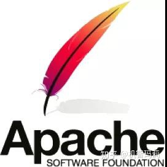
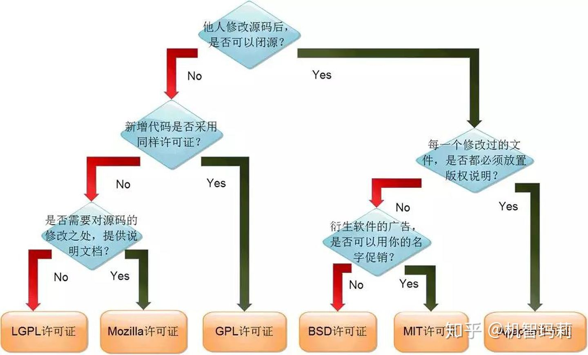

软件在追求“自由”的同时，不能牺牲程序员的利益，否则将会影响程序员的创造激情，因此世界上现在有 60 多种被开源促进组织（Open Source Initiative）认可的开源许可协议来保证开源工作者的权益。

开源协议规定了你在使用开源软件时的权利和责任，也就是规定了你可以做什么，不可以做什么。开源协议虽然不一定具备法律效力，但是当涉及软件版权纠纷时，开源协议也是非常重要的证据之一。

对于准备编写一款开源软件的开发人员，也非常建议先了解一下当前最热门的开源许可协议，选择一个合适的开源许可协议来最大限度保护自己的软件权益。

## 什么是开源许可协议

一个开源许可是一种类型的许可证为计算机软件和其它产品，其允许源代码，蓝图或设计使用，修改和/或在确定的条款和条件共享。
允许最终用户和商业公司审查和修改源代码，蓝图或设计，以满足他们自己的定制，好奇心或故障排除需求。

开源许可软件大多是免费提供的，但并非必须如此，只允许非商业性的许可证仅为个人使用而重新分发或修改源代码通常不被视为开源许可。但是，开源许可证可能有一些限制，特别是关于软件来源的表达，例如要求保留作者姓名和代码中的版权声明，或者要求重新分发许可软件仅在相同的许可下（如在 Copyleft 许可中）。

一组流行的开源软件许可证是开源计划（OSI）基于其开源定义（OSD）批准的许可证。

## 常见的开源协议有哪些

### GPL [ GNU General Public License 通用公共许可证 ]

只要软件中包含了遵循 GPL 协议的产品或代码，该软件就必须也遵循 GPL 许可协议，也就是必须开源免费，不能闭源收费，因此这个协议并不适合商用软件。
遵循 GPL 协议的开源软件数量极其庞大，包括 Linux 系统在内的大多数的开源软件都是基于这个协议的。

GPL 开源协议的主要特点：

- 特点说明复制自由允许把软件复制到任何人的电脑中，并且不限制复制的数量。
- 传播自由允许软件以各种形式进行传播。
- 收费传播允许在各种媒介上出售该软件，但必须提前让买家知道这个软件是可以免费获得的；因此，一般来讲，开源软件都是通过为用户提供有偿服务的形式来盈利的。
- 修改自由允许开发人员增加或删除软件的功能，但软件修改后必须依然基于 GPL 许可协议授权。

### BSD [ Berkeley Software Distribution 伯克利软件发布版 ]

BSD 协议基本上允许用户“为所欲为”，用户可以使用、修改和重新发布遵循该许可的软件，并且可以将软件作为商业软件发布和销售，前提是需要满足下面三个条件：

- 如果再发布的软件中包含源代码，则源代码必须继续遵循 BSD 许可协议。
- 如果再发布的软件中只有二进制程序，则需要在相关文档或版权文件中声明原始代码遵循了 BSD 协议。
- 不允许用原始软件的名字、作者名字或机构名称进行市场推广。

BSD 对商业比较友好，很多公司在选用开源产品的时候都首选 BSD 协议，因为可以完全控制这些第三方的代码，甚至在必要的时候可以修改或者二次开发。

### Apache [ Apache License Version 许可证版本 ]

Apache 和 BSD 类似，都适用于商业软件。Apache 协议在为开发人员提供版权及专利许可的同时，允许用户拥有修改代码及再发布的自由。

现在热门的 Hadoop、Apache HTTP Server、~~MongoDB~~（变更为 SSPL） 等项目都是基于该许可协议研发的，程序开发人员在开发遵循该协议的软件时，要严格遵守下面的四个条件：

- 该软件及其衍生品必须继续使用 Apache 许可协议。
- 如果修改了程序源代码，需要在文档中进行声明。
- 若软件是基于他人的源代码编写而成的，则需要保留原始代码的协议、商标、专利声明及其他原作者声明的内容信息。
- 如果再发布的软件中有声明文件，则需在此文件中标注 Apache 许可协议及其他许可协议。

### MIT [ Massachusetts Institute of Technology ]

目前限制最少的开源许可协议之一（比 BSD 和 Apache 的限制都少），只要程序的开发者在修改后的源代码中保留原作者的许可信息即可，因此普遍被商业软件所使用。

使用 MIT 协议的软件有 PuTTY、X Window System、Ruby on Rails、Lua 5.0 onwards、Mono 等。

### LGPL [ GNU Lesser General Public License 宽通用公共许可证 ]

LGPL 是 GPL 的一个衍生版本，也被称为 GPL V2，该协议主要是为类库设计的开源协议。
LGPL 允许商业软件通过类库引用（link）的方式使用 LGPL 类库，而不需要开源商业软件的代码。这使得采用 LGPL 协议的开源代码可以被商业软件作为类库引用并发布和销售。

但是如果修改 LGPL 协议的代码或者衍生品，则所有修改的代码，涉及修改部分的额外代码和衍生的代码都必须采用 LGPL 协议。
因此 LGPL 协议的开源代码很适合作为第三方类库被商业软件引用，但不适合希望以 LGPL 协议代码为基础，通过修改和衍生的方式做二次开发的商业软件采用。

### SSPL [ Server Side Public License 服务器端公共授权 ]

SSPL 是 MongoDB 创建的一个源码可用的许可证，以体现开源的原则，同时提供保护，防止公有云提供商将开源产品作为服务提供而不回馈。
SSPL 允许自由和不受限制的使用和修改，但如果你把产品作为服务提供给别人，你也必须在 SSPL 下公开发布任何修改以及管理层的源代码。

SSPL 协议并不影响当前使用社区服务器的常规用户。但是，对于云厂商来说，想要将 MongoDB 作为公共服务运行的公司必须将他们的软件开源，或需要从 MongoDB 公司获得商业许可。

根据 SSPL 协议，MongoDB 公司会明确要求托管 MongoDB 实例的云计算公司要么从 MongoDB 公司获取商业许可证，要么向社区开源其服务代码。从而导致了，MongoDB 从 Linux 系统各个平台中 抽离出来了。

### ELv2 [ Elastic License 2.0 ]

Elastic 许可 v2 (ELv2) 是一个非常简单的非 Copyleft 许可，它授权被许可人“使用、复制、分发和提供软件，以及制作软件的衍生作品”，并且只有三个总体性限制。您不得：

- 将产品作为托管服务提供给其他人
- 规避许可密钥功能或移除/隐藏受许可密钥保护的功能
- 移除或隐藏任何许可协议、版权或其他声明

举例被判定为“将软件作为托管或托管型服务提供给第三方”的可能：

#### 我使用 Elasticsearch 在我的猫牌 SaaS 产品上实现了一个搜索框。

ELv2 允许这种使用。

#### 我是一个承包商，负责设置 Elasticsearch 和 Kibana，供我的客户在内部使用。

这在 ELv2 下是可以的，因为您不是将其作为托管服务提供软件。

#### 我的猫牌 SaaS 产品显示了仅供查看的搜索和视图分析的 Kibana 仪表板。

ELv2 允许这种使用。在这种情况下，对 Kibana 的使用会受限，并且这并不意味着可以使用 Kibana 的大部分功能。

#### 我是为我的客户运行 Elasticsearch 和 Kibana 的托管服务提供商 (MSP)。

如果您的客户不访问 Elasticsearch 和 Kibana，ELv2 允许这种使用。如果作为您服务的一部分，您的客户确实可以访问 Elasticsearch 和 Kibana 的大部分功能，这可能是不允许的。

#### 我将 Elasticsearch 和 Kibana 作为服务提供，我的客户可以直接访问 Elasticsearch API 和 Kibana UI 的大部分内容。

ELv2 不允许这种使用。

## 如何选择开源协议

世界上的开源协议有上百种，很少有人能彻底搞清它们之间的区别，即使在最流行的六种开源协议—— GPL、BSD、MIT、Mozilla、Apache 和 LGPL——之中做选择，也很复杂。

乌克兰程序员 Paul Bagwell 画了一张分析图，说明应该怎么选择开源协议，大家看了一目了然，真是清爽。

> 作者：机智玛莉  
> 参考原文：<https://zhuanlan.zhihu.com/p/78998314>
