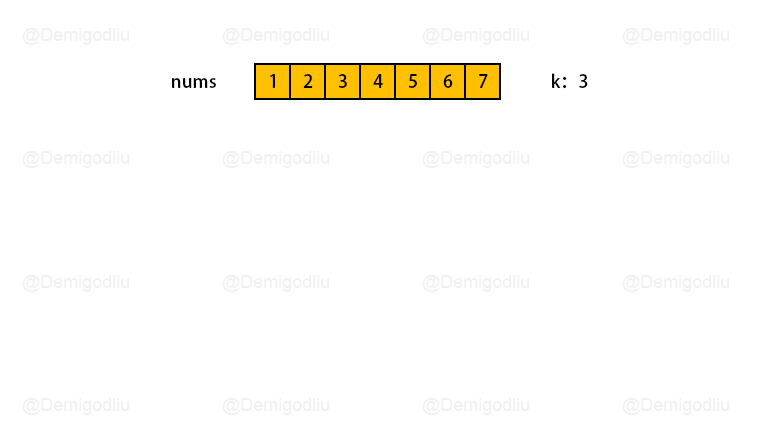
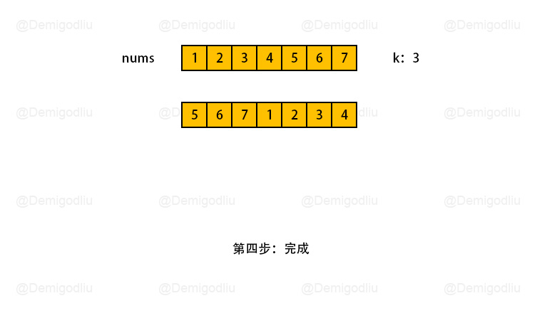
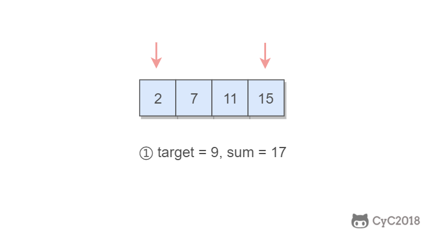
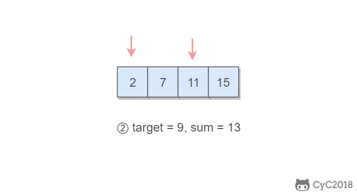
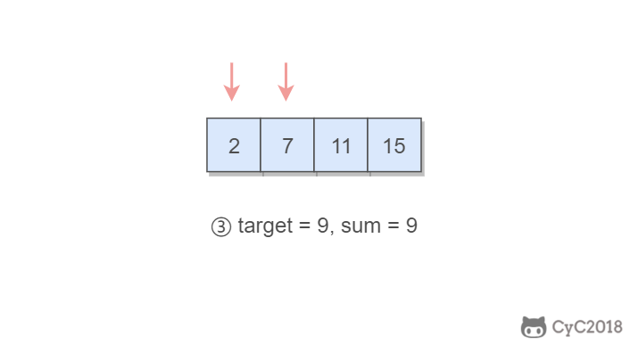

## 数组翻转

如果使用多余数组存储空间，会导致空间复杂度为 n，所以可以使用常量级的空间复杂度解法：**数组翻转**
当我们将数组的元素向右移动 k 次后，尾部 k mod n 个元素会移动至数组头部，其余元素向后移动 k mod n 个位置\_，\_思路如下：

- 首先对整个数组实行翻转，这样子原数组中需要翻转的子数组，就会跑到数组最前面
- 这时候，从 k 处分隔数组，左右两数组，各自进行翻转即可

## 两数之和

一个指针指向值较小的元素，一个指针指向值较大的元素，指向较小元素的指针从头向尾遍历，指向较大元素的指针从尾向头遍历。

1. 如果两个指针指向元素的和sum == target，那么得到要求的结果；
2. 如果sum > target，移动较大的元素，使 sum 变小一些；
3. 如果sum < target，移动较小的元素，使 sum 变大一些。

数组中的元素最多遍历一次，时间复杂度为 O(N)。只使用了两个额外变量，空间复杂度为 O(1)。

## 快慢指针

用两个指针 slow 与 fast 一起遍历链表，slow 一次走一步，fast 一次走两步，那么当 fast 到达链表的末尾时，slow 必然位于中间
