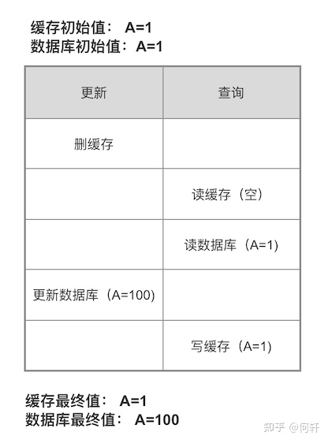
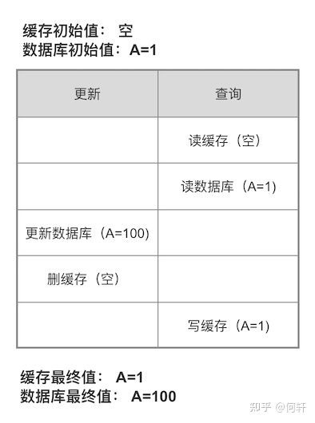
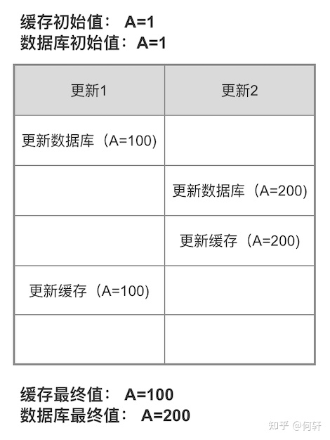
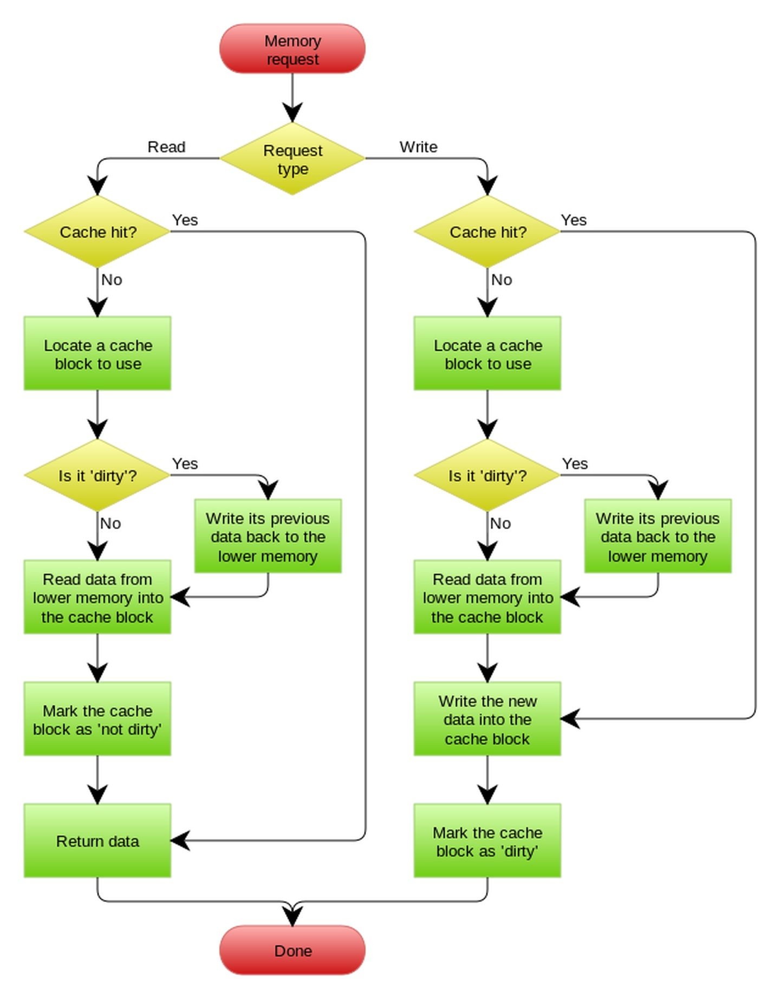

缓存一般是为了应对高并发场景、缓解数据库读写压力，而将数据存储在读写更快的某种存储介质中（如内存），以加快读取数据的速度。

缓存一般分为本地缓存（如 java 堆内存缓存）、分布式缓存（如 redis)等。

既然是缓存，就意味着缓存中暂存的数据只是个副本，也就意味着需要保证副本和主数据之间的数据一致性，这就是接下来要分析的缓存的更新。

常见的缓存更新策略有：

- 先删缓存，再更新数据库
- 先更新数据库，再删缓存
- 先更新数据库，再更新缓存
- read/write through
- 写回。在更新数据的时候，只更新缓存，不更新数据库，而我们的缓存会异步地批量更新数据库

## 先删缓存再更新数据库

很明显这个逻辑是有问题的，假设有两个并发操作，一个操作更新、另一个操作查询，更新操作删除缓存后还没来得及更新数据库，此时另一个用户发起了查询操作，它因没有命中缓存进而从数据库读；

此时第一个操作还没到更新数据库的阶段，读取到的是老数据，接着写到缓存中，导致缓存中数据变成脏数据，并且会一直脏下去直到缓存过期或发起新的更新操作。

## 先更新数据库，再删缓存



这是目前业界最常用的方案



虽然它同样不够完美，但问题发生的概率很小，它的读流程和写流程见下图

写操作先更新数据库，更新成功后使缓存失效。

读操作先读缓存，缓存中读到了则直接返回，缓存中读不到再读数据库，之后再将数据库数据加载到缓存中。

但它同样也有问题，如下图，查询操作未命中缓存，接着读数据库老数据之后、写缓存之前，此时另一个用户发起了更新操作更新了数据库并清了缓存，接着查询操作将数据库中老数据更新到缓存。

这就导致缓存中数据变成脏数据，并且会一直脏下去直到缓存过期或发起新的更新操作。

为什么这种思路存在这么明显的问题，却还具有那么广泛的应用呢？因为这个 case 实际上出现的概率非常低，产生这个 case 需要具备如下 4 个条件：

- 读操作读缓存失效
- 有个并发的写操作
- 写操作比读操作更快
- 读操作早于写操作进入数据库，晚于写操作更新缓存

而实际上数据库的写操作会比读操作慢得多，而且还要锁表，而读操作必需在写操作前进入数据库操作，而又要晚于写操作更新缓存，所有的这些条件都具备的概率基本并不大。并且即使出现这个问题还有一个缓存过期时间来自动兜底。

## 先更新数据库，再更新缓存

相对来讲，理论上这种方式比先更新数据库再删缓存有着更高的读性能，因为它事先准备好数据。

但由于要更新数据库和缓存两块数据，所以它的写性能就比较低，而且关键在于它也会出现脏数据，如下图，两个并发更新操作，分别出现一前一后写数据库、一后一前写缓存，则最终缓存的数据是二者中前一次写入的数据，不是最新的。

## Read/Write Through 缓存代理

Read/Write Through 套路是把更新数据库（Repository）的操作由缓存自己代理了，所以，对于应用层来说，就简单很多了。

可以理解为，应用认为后端就是一个单一的存储，而存储自己维护自己的 Cache。

数据库由缓存代理，缓存未命中时由缓存加载数据库数据然后应用从缓存读，写数据时更新完缓存后同步写数据库。应用只感知缓存而不感知数据库。

## 写回

这种方式英文名叫 Write Behind 又叫 Write Back。

一些了解 Linux 操作系统内核的同学对 write back 应该非常熟悉，这不就是 Linux 文件系统的 Page Cache 的算法吗？是的，就是那个东西。

这种模式是指在更新数据的时候，只更新缓存，不更新数据库，而我们的缓存会异步地批量更新数据库。

这种方式的问题在于数据不是强一致性的，而且可能会丢失（我们知道 Unix/Linux 非正常关机会导致数据丢失，就是因为这个）。

另外，Write Back 实现逻辑比较复杂，因为他需要 track 有哪数据是被更新了的，需要刷到持久层上。

操作系统的 write back 会在仅当这个 cache 需要失效的时候，才会被真正持久起来，比如，内存不够了，或是进程退出了等情况，这又叫 lazy write。

## 总结

本文归纳了常见的缓存更新的五种思路，其中先更新数据库再删缓存的思路是目前使用得最多的。先删缓存再更新数据库因为出问题概率太大并没有什么用。第三到第五种思路在特定的应用场景下也有很多用途，比如先更新数据库再更新缓存可以解决高并发下缓存未命中导致瞬时大量请求穿透到数据库的问题。**每一种方案也有其各自的优点和不足，总而言之，没有完美的方案，只有契合场景的更适合的方案。**

> 作者：何轩  
> 原文：<https://zhuanlan.zhihu.com/p/86396877>
