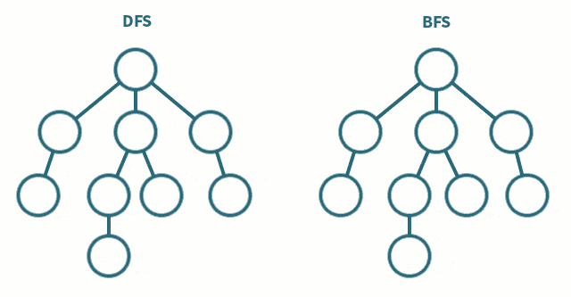

DFS（深度优先搜索）和 BFS（广度优先搜索）

## 腐烂的橘子

- 一开始，我们找出所有腐烂的橘子，将它们放入队列，作为第 0 层的结点。
- 然后进行 BFS 遍历，每个结点的相邻结点可能是上、下、左、右四个方向的结点，注意判断结点位于网格边界的特殊情况。
- 由于可能存在无法被污染的橘子，我们需要记录新鲜橘子的数量。在 BFS 中，每遍历到一个橘子（污染了一个橘子），就将新鲜橘子的数量减一。如果 BFS 结束后这个数量仍未减为零，说明存在无法被污染的橘子。
