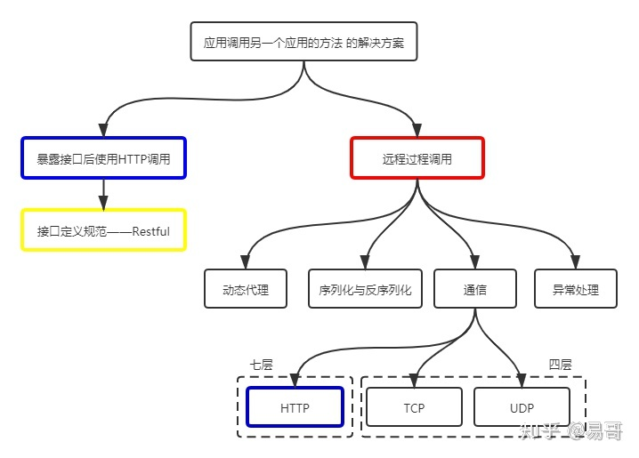

首先，HTTP 和 RPC 不是对等的概念

RPC 是一个完整的远程调用方案，它包括了：**接口规范** + **序列化反序列化规范** + **通信协议** 等，而 HTTP 只是一个通信协议，工作在 OSI 的第七层，不是一个完整的远程调用方案

> _基于 HTTP 的远程调用方案（包含了接口规范、序列化反序列化等） 和 使用 RPC 的远程调用方案 有什么不同 ？_

我们先介绍基于 HTTP 的远程调用方案。

HTTP + Restful，其优势很大。它可读性好，且可以得到防火墙的支持、跨语言的支持。而且，在近几年的报告中，Restful 大有超过 RPC 的趋势。

但是使用该方案也有其缺点，这是与其优点相对应的：

- 首先是有用信息占比少，毕竟 HTTP 工作在第七层，包含了大量的 HTTP 头等信息。
- 其次是效率低，还是因为第七层的缘故，必须按照 HTTP 协议进行层层封装。
- 还有，其可读性似乎没有必要，因为我们可以引入网关增加可读性。
- 此外，使用 HTTP 协议调用远程方法比较复杂，要封装各种参数名和参数值。

而 RPC 则与 HTTP 互补，我们详细介绍下。看完这篇回答，能让你对 RPC 的产生、原理、实现代码都有着清晰的了解。

这样，也能在业务系统中，在 RPC 和 HTTP 之间做好抉择。

但需要再说一句，不是说 RPC 好，也不是说 HTTP 好，两者各有千秋，还在比拼中。

要问我站谁？我根据业务场景，灵活站位……

评论区产生了一些争论，我在这里统一进行说明。争论主要发生在两点：

1. HTTP 和 RPC 同一级别，还是被 RPC 包含？
2. Restful 也属于 RPC 么？

对于以上两点，我画图来一一说明。

上图是一个比较完整的关系图，这时我们发现 HTTP（图中蓝色框）出现了两次。其中一个是和 RPC 并列的，都是跨应用调用方法的解决方案；另一个则是被 RPC 包含的，是 RPC 通信过程的可选协议之一。

因此，第一个问题的答案是都对。看指的是哪一个蓝色框。从题主的提问看，既然题主在纠结这两者，应该是指与 RPC 并列的蓝色框。所以，题主所述的 HTTP 请求应该是指：基于 HTTP 的远程调用方案（包含了接口规范、序列化反序列化等）。这样，它才是和 RPC 同一级别的概念。

第二个问题是在问远程过程调用（红色框）是不是包含了 Restful（黄色框），这种理解的关键在于对 RPC 的理解。

RPC 字面理解是远程过程调用，即在一个应用中调用另一个应用的方法。那 Restful 是满足的，通过它可以实现在一个应用中调用另一个应用的方法。

但是，上述理解使得 RPC 的定义过于宽泛。RPC 通常特指在一个应用中调用另一个应用的接口而实现的远程调用，即红色框所指的范围。这样，RPC 是不包含 Restful 的。

因此，第二个问题的答案是 Restful 不属于 RPC，除非对 RPC 有着非常规的宽泛理解。

RPC 的英文全称是 Remote Procedure Call，翻译为中文叫“远程过程调用”。其中稍显晦涩的其实就是“过程”，过程其实就是方法。所以，可以把 RPC 理解为“远程方法调用”。

要了解远程过程调用，那先理解过程调用。非常简单，如下图，就是调用一个方法。这太常见了，不多解释。

而在分布式系统中，因为每个服务的边界都很小，很有可能调用别的服务提供的方法。这就出现了服务 A 调用服务 B 中方法的需求，即远程过程调用。

要想让服务 A 调用服务 B 中的方法，最先想到的就是通过 HTTP 请求实现。是的，这是很常见的，例如服务 B 暴露 Restful 接口，然后让服务 A 调用它的接口。基于 Restful 的调用方式因为可读性好（服务 B 暴露出的是 Restful 接口，可读性当然好）而且 HTTP 请求可以通过各种防火墙，因此非常不错。

然而，如前面所述，基于 Restful 的远程过程调用有着明显的缺点，主要是效率低、封装调用复杂。当存在大量的服务间调用时，这些缺点变得更为突出。

服务 A 调用服务 B 的过程是应用间的内部过程，牺牲可读性提升效率、易用性是可取的。基于这种思路，RPC 产生了。

通常，RPC 要求在调用方中放置被调用的方法的接口。调用方只要调用了这些接口，就相当于调用了被调用方的实际方法，十分易用。于是，调用方可以像调用内部接口一样调用远程的方法，而不用封装参数名和参数值等操作。

那要想实现这个过程该怎么办呢？别急，咱们一步一步来。

首先，调用方调用的是接口，必须得为接口构造一个假的实现。显然，要使用动态代理。这样，调用方的调用就被动态代理接收到了。

第二，动态代理接收到调用后，应该想办法调用远程的实际实现。这包括下面几步：

- 识别具体要调用的远程方法的 IP、端口
- 将调用方法的入参进行序列化
- 通过通信将请求发送到远程的方法中

这样，远程的服务就接收到了调用方的请求。它应该：

- 反序列化各个调用参数
- 定位到实际要调用的方法，然后输入参数，执行方法
- 按照调用的路径返回调用的结果

整个过程如下所示。

这样，RPC 操作就完成了。

调用方调用内部的一个方法，但是被 RPC 框架偷梁换柱为远程的一个方法。之间的通信数据可读性不需要好，只需要 RPC 框架能读懂即可，因此效率可以更高。通常使用 UDP 或者 TCP 作为通讯协议，当然也可以使用 HTTP。例如下面的示例中，为了保证实现最简单，就用了 HTTP 进行通信。

讲到这里，RPC 的产生原因、原理应该清楚了。

所以，不要被 RPC 吓到，它就是让一个应用调用另一个应用中方法的一种实现方式。与调用远程接口区别不大，条条大路通罗马。

再说一次，不是说 RPC 好，也不是说 HTTP 好，两者各有千秋。本质上，两者是可读性和效率之间的抉择，通用性和易用性之间的抉择。最终谁能发展更好，很难说。

要问我站谁？我根据业务场景，灵活站位……

> 作者：易哥  
> 原文：https://www.zhihu.com/question/41609070/answer/1030913797
