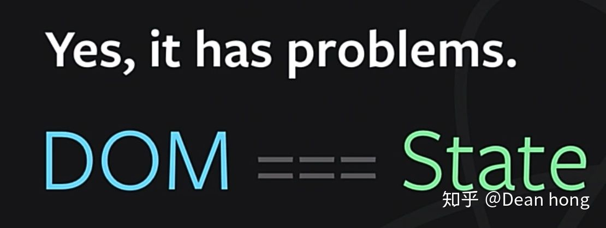
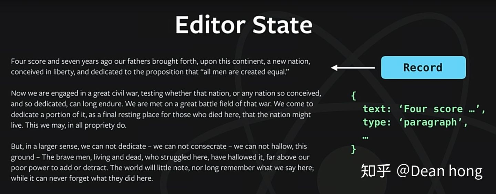
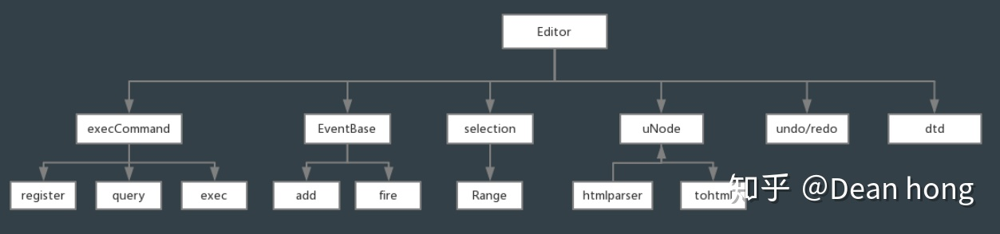
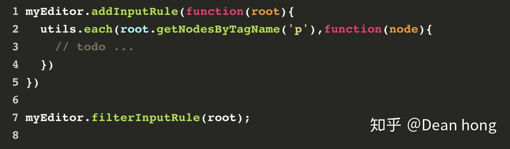
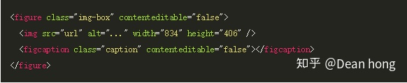
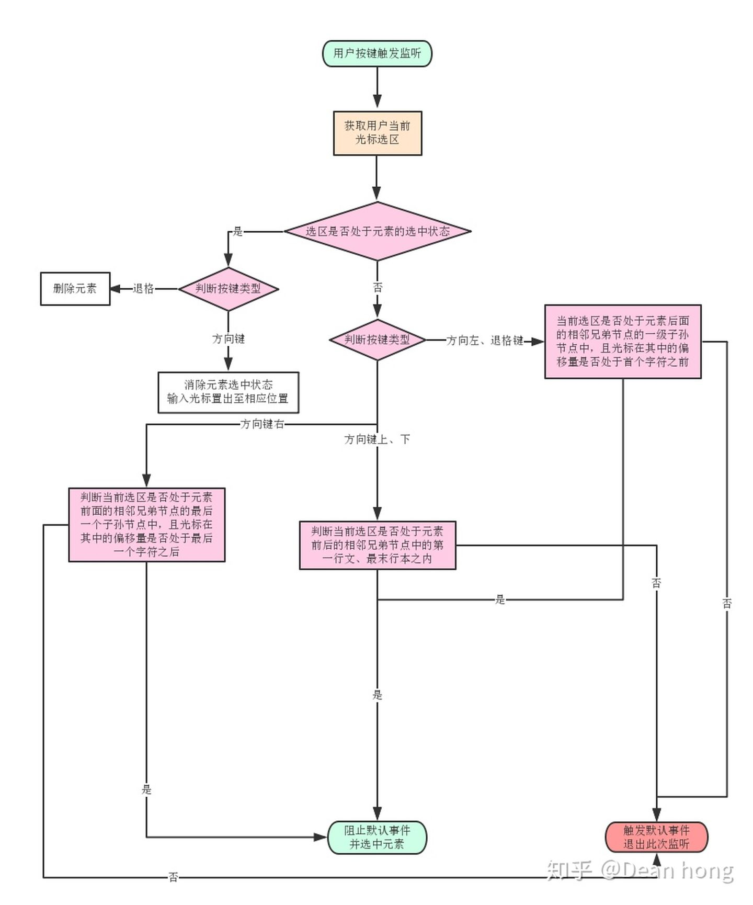
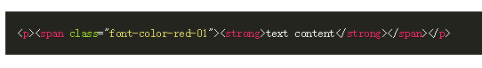
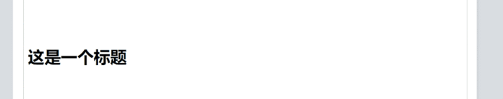

富文本编辑器一直是前端领域的一个天坑，但若不是深入接触编辑器开发的工程师，却不一定清楚富文本编辑器到底坑在哪里，作为有幸和编辑器打了一年交道的前端，今天来聊聊 Web 富文本编辑器的那些事。

通常当我们拿到一个带有富文本编辑器的需求时，我们首先要理清这个需求的使用场景，然后我们可以为这些具体的业务场景选择一款合适的开源富文本编辑器，进行定制开发。看看目前市面上我们可以选择的开源编辑器的实现方式，大致分为两种：

## 基于 HTML DOM 的 Contenteditable 属性来实现

_代表如 UEditor、TinyMCE、Quill_

这是使用最久的传统富文本编辑器实现方式，这种实现方式的优势很明显，contenteditable 是浏览器 Dom 的一个原生属性，值为 true 时表示该元素变为可编辑状态。因此原生就直接支持很多内容编辑操作，包括光标位移、内容选择的行为、键盘事件（如方向键控制光标）等等，甚至是富文本编辑所需要用到的绝大部分实现（[document.execCommand](https://developer.mozilla.org/zh-CN/docs/Web/API/Document/execCommand)）

这些原生支持使得性能和输入体验都非常棒，在此基础之上进行二次开发看起来相当容易，辅以 iframe 技术，可以将编辑器放在一个独立的 docment 对象下，与页面的 document 对象分离

缺点也非常要命，以 [why-contenteditable-is-terrible](https://www.oschina.net/translate/why-contenteditable-is-terrible?cmp) 为代表的文章，几乎说明了一切，总结下来无非是：浏览器兼容性差、用户行为难以控制、难以抽象编辑器内的视图逻辑关系并将它们映射到代码模型中（试想一下你要抽象一个变化规则不可掌控的可变 Dom 结构的逻辑关系）、光标（选区）的视觉位置与逻辑位置可能不吻合

## 基于自定义 Model 的实现

_代表如：draft.js、trix_

这种实现方式，简单的来说就是定义一套编辑器内部使用的数据结构（model），与用户在编辑器内所见的 Dom 视图相映射；通过捕获用户的操作行为，由原先的直接操作 Dom，改为更新数据结构状态，再将更新后的状态映射至视图的方式，来实现编辑器的所见即所得，显然操作行为对数据结构的更新是非常可控的

这是一种十分先进的编辑器设计理念，它几乎抛弃了 contenteditable 的特性，这也意味着 contenteditable 所带来的副作用都消失了

这种实现方式的另一个好处在于，它可以适用于多人在线协作的业务场景。由于用户操作实际影响的是内部的数据结构，且每次操作产生的结果都被控制在一定范围内（只影响部分节点），可以较为容易的通过锁和 diff 算法来合并短时间内的多次修改。

看起来这显然是一个比 contenteditable 编辑器更好的选择

遗憾的是目前这种实现方式的开源编辑器可供选择的并不多，实际情况中可能并不能满足所有的开发场景，比如 draft.js 只能基于 react 而且并非开箱即用，而如 trix 这样相对小众的项目在国内则有些水土不服（别问我怎么知道的），如果你目前使用的不是 react 或者就想要一个开箱即用的编辑器去做定制，又没有条件自己造个轮子，在不需要考虑多人协作场景的情况下，我们依然可以从 contenteditable 编辑器上寻求突破

回过头来看看 contenteditable 编辑器，现实情况其实也没有那么糟糕，毕竟这是使用最为广泛的一种实现方式，拥有大量的实践，这些成熟的开源项目早已为我们提供了解决方案

## 来看看它们是怎么做的吧

以国内熟知的 **UEditor** 为例（也是微信公众号所用的编辑器），它的核心提供了这么几样东西

**dtd 规则：**用来规定编辑器内的 dom 嵌套规则，和过滤方法搭配使用，避免出现 `
xxx
`

**uNode 对象：**根据 HTML DOM 抽象而成的文档模型对象，抽象了 dom 的属性和层级关系，保留了一些 dom 操作的方法（与第二种实现方式的自定义 model 类似），将编辑器内容的 HTML 映射过来之后可以很方便的执行规则过滤，如剔除冗余属性和非白名单标签等

**Range 对象：**光标和选区的信息对象，记录了 当前光标（选区）的开始、结束边界的容器节点和偏移量以及当前光标（选区）的闭合状态，还提供了一系列对光标（选区）操作的 API

**EventBase：**提供注册、销毁和触发自定义事件监听器的方法，用来生成一些钩子

**execCommand 指令集：**document.execCommand 增强版，执行指令的通用接口，富文本格式操作的核心，提供了一系列指定命令的执行和状态查询方法（如对选区内容执行字体加粗命令、查询当前选区内容是否处于加粗状态）

**undoManager：**撤销重做的堆栈，记录内容变化过程

**domUtils：**Dom 操作方法集

可以利用上面这些核心方法组合出一些实用的工具，比如在 UEditor 中非常重要的过滤规则体系，就是利用了 eventBase 与 uNode 的组合实现的（通过对 eventbase 封装了注册规则的方法和执行过滤的方法，参数就是根据编辑器内容的 dom 转化而来的 uNode 对象，基于该对象执行具体的过滤）

整个 UEditor 正是围绕着这些核心对象构建的，并且在此基础上提供了大量的 API 以便开发者进行定制化的开发，显然作为一个 contenteditable 编辑器它已经足够成熟了

但在实际的生产环境中，面对不同的产品需求我们依然需要处理一些棘手的情况

### 固定结构内容

一个常见的场景是，固定结构内容，比如图片与图片注释

这就是一个典型的固定结构内容，编辑器中出现了一个不可更改的固定搭配，即图片后面必须跟着注释输入框

来看看要实现这个需求需要考虑哪些要问题

1. 图片和注释元素必须一对一
2. 图片和注释元素的位置顺序不能改变
3. 光标不允许插入到固定结构中间
4. 光标可以定位在注释元素里
5. 注释元素里只能放纯文本

contenteditable 编辑器的设计原则之一是编辑器内的一切内容皆可自由编辑，而固定结构元素某种程度上违背了这一原则，这会带来很多问题，用户有太多方法可以破坏你预设的结构

一种常见的解决方案是将固定结构的元素包裹在一个不可编辑元素内，并为其中的可交互元素独立设置交互事件（比如点击输入、粘贴内容过滤）

但这还不够，有几个问题：

1. 编辑器中存在不可编辑元素，会有浏览器兼容性的问题，如火狐浏览器下光标无法正确移动甚至无法删除这个元素
2. 两个不可编辑器的块级元素在相邻位置时，光标无法插入中间，退格键也会同时删除多个
3. 复制粘贴这个内容，结构可能会错乱
4. 其他操作也可能会破坏结构

为了解决上述问题，就需要劫持用户的光标操作（鼠标点击、方向键、退格键），同时设立一套结构规则来检查当前结构是否有错乱

简而言之，就是通过劫持，判断光标是否处于不可编辑元素的最近位置，符合条件时，用自定义行为代理浏览器默认的选择、删除、复制剪切等行为

再通过对光标移动事件（onSelectionChange）的监听，检查内容中的固定结构是否符合规则（如两个不可编辑元素之间必须至少存在一个用于插入光标的空行标签等）

面对固定结构内容，根据不同的使用场景，可以有两种解决方案，

对于结构简单但需要进行交互的场景，就像图片注释那样，可以使用前面提到的 contenteditable=false+行为劫持+过滤规则的方式实现

对于结构较为复杂但不需要进行交互或交互场景较为简单的情况，则可以使用 canvas 来实现

使用 canvas 的好处是不用担心结构问题，这完全就是一张图片，如果在文章发布后需要其他交互也可以在详情页将之转化为正常的 DOM 结构，缺点是生成的图片需要上传至图片服务器这会占用额外的存储资源

另一个需要考虑的问题是在 safari 浏览器下如果画布上有其他域过来的图片，就算设置了允许跨域也会被 safari 的安全策略 block\[SecurityError (DOM Exception 18): The operation is insecure.]，这就可能需要使用本地占位图来解决

可以根据实际情况来选择解决方案

### 光标

除此之外，UE 也存在一些作为 contenteditable 编辑器的通病，一个最常见的问题就是光标的视觉位置与逻辑位置的问题

试想有这么一段标红的粗体文本

当我们将光标放在这段文字的开头，我们会发现，光标的实际位置有 4 种可能

- `|
...`
- `
|<strong>...`
- `
<strong>|text content`

尽管视觉上的表现没有什么区别，但光标在不同位置时用户进行某些操作就会产生不同的结果

> 原本我们只是想用退格键将标题上移一行，但由于光标位置在 `<h1>|...</h1>` 的位置上，结果将标题的格式也给清空了

解决方法也很简单，还是 劫持=>判断=>代理，这也是编辑器对光标进行严格控制的通用解决方案

### 撤销重做堆栈

撤销重做堆栈也是一个问题，正常情况下 undoManager 会按照一个最小时间段自动记录每一次的内容变化，以便用户撤销回上一步的状态，但这也会带来一些问题，试想一个这样的场景

我们从本地插入一张图片，这张图片最终需要上传到服务器上，所以我们先在编辑器内插入了一个占位图，然后开始上传本地图片，等服务器返回了正确的图片地址后，再将正确的图片元素替换到占位图所在的位置上，顺便为图片添加图片注释的组件

那么 （插入占位图 => 上传图片 => 替换占位图 => 添加附加组件）就是一个完整的事件流，如果 undoManager 单独记录了这个事件流中每一个步骤，当用户执行撤销操作的时候就会出现问题

因此我们需要为自动记录设置一个暂停开关，这样就可以控制 undoManager 的记录时机

### 生命周期钩子

为了使编辑器更加稳定，我们还可以通过 eventBase 来设计某些事件的生命周期钩子

比如可以分发撤销、重做操作完成前后的回调来做一系列额外的处理，也可以对图片上传的过程分发钩子函数

富文本编辑器的话题其实远不止上面这些，比如如何优雅的与编辑器内元素进行交互，如何由 State 驱动 Dom，如何做移动端的适配，表格操作等等，每一点都可以深入探讨，篇幅有限，这里就不再展开

总结一下，基于 contenteditable 编辑器稳定可靠的定制开发要注意的几个点

1. 严格控制内容（格式规则检查、内容输入和输出过滤）
2. 严格控制光标（劫持、检查、代理）
3. 控制撤销重做堆栈
4. 为一些关键操作添加生命周期钩子

> 作者：Dean hong  
> 原文：<https://zhuanlan.zhihu.com/p/37051858>
