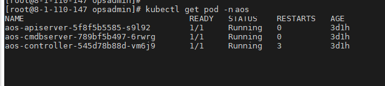

## 问题描述

在节点处于“不可用”状态时，CCE 会迁移节点上的容器实例，并将节点上运行的 pod 置为“Terminating”状态。

待节点恢复后，处于“Terminating”状态的 pod 会自动删除。
偶现部分 pod（实例）一直处于“Terminating ”状态：



通过 kubectl delete pods <podname> -n <namespace> 命令始终无法将其删除：

```shell
kubectl delete pods aos-apiserver-5f8f5b5585-s9l92 -n aos
```

## 解决方法

无论各种方式生成的 pod，均可以使用如下命令强制删除：

```shell
kubectl delete pods <pod> --grace-period=0 --force
```

因此对于上面的 pod，我们只要执行如下命令即可删除：

```shell
kubectl delete pods aos-apiserver-5f8f5b5585-s9l92 --grace-period=0 --force
```
